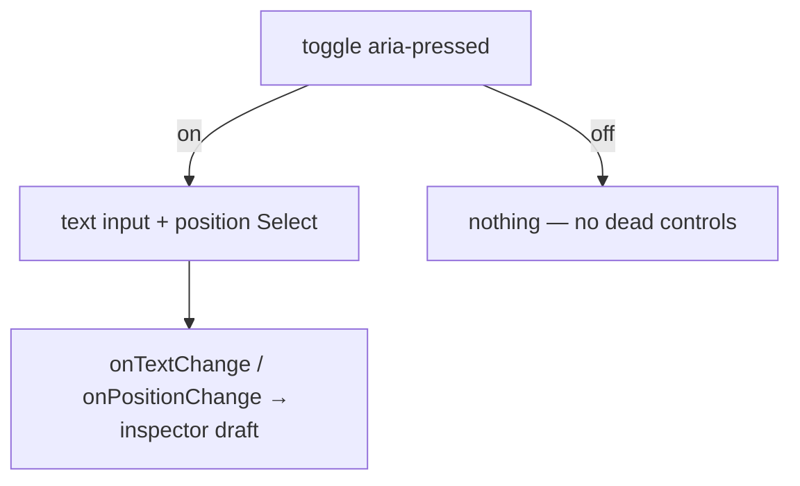

# ShotTitleField.tsx — AI component doc

> AI-facing sidecar for `ShotTitleField.tsx`. Created 2026-07-09. Keep this in sync with the code on every change.

## Purpose

The optional title-overlay sub-form of the shot inspector: an amber toggle pill
and, when it is on, the overlay text + its position. Extracted from
`ShotInspector` — it is the only sub-form there with its own on/off state and
progressive disclosure, and inlining it is what pushed that file past 200 lines.

## What it does (for an AI reader)

- Responsibilities: render the toggle + (conditionally) the text input and the
  position `Select`. Fully controlled — it holds no state of its own.
- Public API / exports: `ShotTitleField`, `ShotTitleFieldProps =
  { isEnabled, onToggle, text, onTextChange, position, onPositionChange }`.
- Inputs → Outputs: draft values → change callbacks the inspector folds into its
  one `UpdateShotInput` patch.
- Side effects: none.

## Dependencies

- Imports: `react-i18next`, `titlePositionSchema` + `TitlePosition` from
  `@opencreate/contracts`, `Select` from `shared/ui`.
- Used by: `ShotInspector` (inside an `InspectorSection`).

## Diagram

## Key decisions / gotchas

- `aria-pressed` toggle button, not a checkbox — the kit's amber selection
  language (same convention as `PillGroup`).
- The text input has no visible `<label>`; its placeholder doubles as the field
  name, so it carries an explicit `aria-label` (a placeholder is not a name).
- Position options come from `titlePositionSchema.options` — the contract is the
  single source of truth, never a hand-written list.

## Commits

- _no commit yet_
