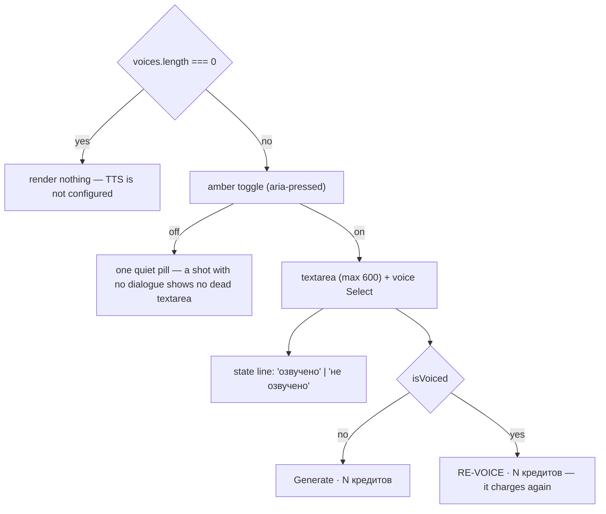

# ShotVoiceoverField.tsx — AI component doc

> AI-facing sidecar for `ShotVoiceoverField.tsx`. Created 2026-07-11. Keep this in sync with the code on every change.

## Purpose

The "Voice" group of the shot inspector: the line this beat's character speaks, who speaks
it, and the button that turns it into audio on the timeline.
ADR: `docs/wiki/decisions/template-catalog.md` §4.

## What it does (for an AI reader)

- Responsibilities: disclose the voice fields behind an amber toggle, and make the cost and
  the already-voiced state impossible to miss.
- Public API / exports / props: `ShotVoiceoverField`, `ShotVoiceoverFieldProps =
  { isEnabled, onToggle, text, onTextChange, voice, onVoiceChange, voices: string[],
  credits: number, isVoiced: boolean, onGenerate, isGenerating }`.
- Inputs → Outputs: fully controlled — the draft lives in `ShotInspector`. Emits
  `onToggle` / `onTextChange` / `onVoiceChange` / `onGenerate`.
- Side effects (I/O, network, state): none. The mutation belongs to the parent.

## Dependencies

- Imports / depends on: `react-i18next`, `shared/ui` (`Button`, `Select`), `./icons`
  (`MicIcon`, `SparkIcon`).
- Used by: `ShotInspector` (section 5, only when the catalog offers a tts model).

## Diagram

## Key decisions / gotchas

- **Two things this control is careful about, both about money:**
  1. **The price is ON the button.** Generating a line costs credits. A bare "Generate"
     next to a textarea reads like a preview; the credit count makes it read like what it
     is.
  2. **Voiced is a visible state.** Once a shot has a track, the action becomes "Re-voice"
     and says so — because re-voicing charges again, and the user is entitled to know they
     are about to pay for something they already have. The API replaces rather than
     appends, so they will not end up with two lines playing over each other; but the second
     charge is real.
- **`voices.length === 0` hides the whole group** rather than offering a button that cannot
  work — that is what "TTS is not configured in the catalog" looks like from here.
- Mirrors `ShotTitleField`: an amber toggle discloses the fields, so a shot with no dialogue
  shows one quiet pill instead of a dead textarea.
- `maxLength={600}` matches `shotVoiceoverSchema` on the wire — the client cannot compose a
  line the API would reject on length.
- The parent (`ShotInspector`) owns `isGenerating`, and it spans BOTH legs of the
  save-then-voice chain — deriving it from the voiceover mutation alone would leave the
  button live during the PATCH, and a double-click there is a double charge.

## Commits

- _no commit yet_
