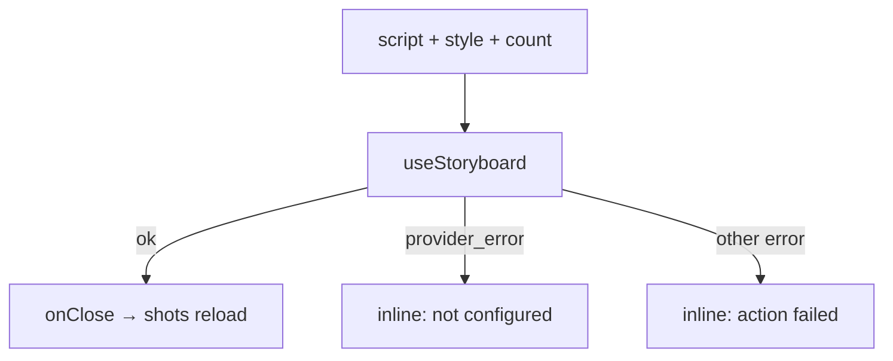

# StoryboardModal.tsx — AI component doc

> AI-facing sidecar for `StoryboardModal.tsx`. Created 2026-07-09. Keep this in sync with the code on every change.

## Purpose

Script → draft shots: a modal with a script textarea, a style picker and an
optional shot count. The returned drafts appear on the timeline once the film
reloads. Key-gated on the API: an unset LLM key surfaces INLINE as
"not configured", not a crash.

## What it does (for an AI reader)

- Responsibilities: collect the script + options; POST; surface unavailability calmly.
- Public API / exports: `StoryboardModal`,
  `StoryboardModalProps = { filmId, defaultStyleId, isOpen, onClose }`.
- Inputs → Outputs: form → `CreateStoryboardInput` → draft shots (via invalidate).
- Side effects: `useStoryboard` mutation.

## Dependencies

- Imports: `react` (`useState`), `react-i18next`, `shared/ui`
  (`Button`, `Modal`, `Select`), `ApiClientError`, `useStoryboard`, `STYLE_OPTIONS`.
- Used by: `FilmEditor`.

## Diagram

## Key decisions / gotchas

- A clean `provider_error` (ApiClientError code) is treated as "storyboarding
  isn't configured" — an expected, non-alarming state (amber `role=status`).

## Commits

- _no commit yet_

## Update 2026-07-31 — style picker reads the registry
- Gains `styles?: readonly Style[]` (route-injected via `FilmEditor`) and passes it
  to `styleOptions(styles, t)`. A storyboard can now cite a style the user wrote in
  the Style Studio, like every other style picker (ADR style-studio D5).
- Defaults to `[]`, which `styleOptions` reads as "not loaded" and answers with the
  bundled builtins — so an in-flight or failed registry never empties this picker.
- `defaultStyleId` is unchanged and still an open `StyleId`: a film's default may
  already BE a user style, and it prefills here exactly as a builtin id always did.
