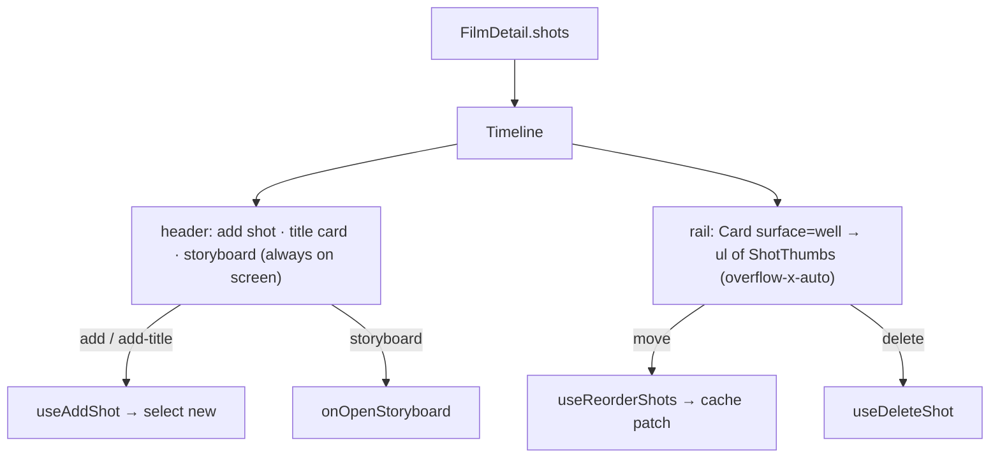

# Timeline.tsx — AI component doc

> AI-facing sidecar for `Timeline.tsx`. Created 2026-07-09. Keep this in sync with the code on every change.

## Purpose

The film strip: a full-width band under the workspace. A HEADER of authoring
controls (add shot · title card · storyboard) over a recessed RAIL that holds
only the ordered `ShotThumb`s.

## What it does (for an AI reader)

- Responsibilities: own the strip layout + shot CRUD/reorder; lift selection to
  the editor.
- Public API / exports: `Timeline`, `TimelineProps`
  (`film`, `selectedShotId`, `onSelectShot`, `onOpenStoryboard`).
- Inputs → Outputs: `FilmDetail` → the strip; button clicks → shot mutations.
- Side effects: `useAddShot`, `useDeleteShot`, `useReorderShots`.

## Dependencies

- Imports: `react-i18next`, `Button` + `Card` from `shared/ui`, shot mutations,
  `ShotThumb`, icons.
- Used by: `FilmEditor`.
- Tested by: `Timeline.test.tsx`.

## Diagram

## Key decisions / gotchas

- **The add controls live in the header, never in the rail.** They used to be
  pinned to the tail of the `overflow-x-auto` strip, so a film with many shots
  scrolled its primary "add shot" affordance off the right edge. `Timeline.test.tsx`
  guards this: the buttons must not be inside the shot `<ul>`.
- The rail is a `<ul>`/`<li>` list — real list semantics, and the `<li>` (the flex
  child) carries `shrink-0`, not the thumb.
- Reorder swaps two ids and POSTs the FULL order — the client never computes
  `orderIndex`; the server owns it and the returned list is patched into cache.
- Deleting the selected shot clears the selection so the inspector never dangles.

## Commits

- _no commit yet_
