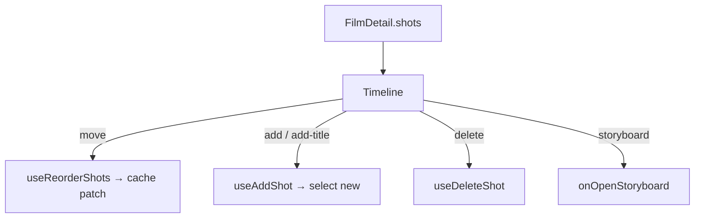

# Timeline.tsx — AI component doc

> AI-facing sidecar for `Timeline.tsx`. Created 2026-07-09. Keep this in sync with the code on every change.

## Purpose

The horizontal shot strip and its editing controls: ordered `ShotThumb`s,
reorder-by-buttons, add-shot / add-title-card, and the storyboard entry.

## What it does (for an AI reader)

- Responsibilities: own the strip layout + shot CRUD/reorder; lift selection to the editor.
- Public API / exports: `Timeline`, `TimelineProps`
  (`film`, `selectedShotId`, `onSelectShot`, `onOpenStoryboard`).
- Inputs → Outputs: `FilmDetail` → the strip; button clicks → shot mutations.
- Side effects: `useAddShot`, `useDeleteShot`, `useReorderShots`.

## Dependencies

- Imports: `react-i18next`, `Button` from `shared/ui`, shot mutations,
  `ShotThumb`, icons.
- Used by: `FilmEditor`.

## Diagram

## Key decisions / gotchas

- Reorder swaps two ids and POSTs the FULL order — the client never computes
  `orderIndex`; the server owns it and the returned list is patched into cache.
- Deleting the selected shot clears the selection so the inspector never dangles.

## Commits

- _no commit yet_
