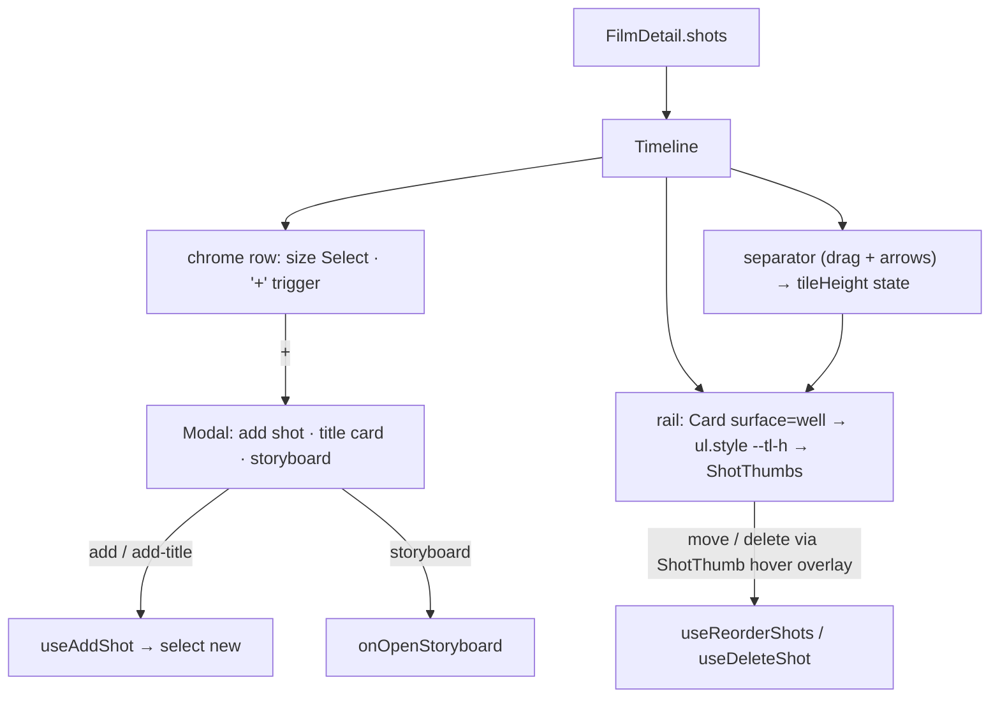

# Timeline.tsx — AI component doc

> AI-facing sidecar for `Timeline.tsx`. Created 2026-07-09. Keep this in sync with the code on every change.

## Purpose

The film strip: a compact, RESIZABLE band between the title row and the
workspace. A minimal chrome row (strip name · size `Select` · one "+" trigger)
over a recessed RAIL of ordered `ShotThumb`s, with a drag/keyboard resize
separator on the rail's bottom edge. Authoring actions live in a dialog behind
the "+" trigger, not in standing chrome.

## What it does (for an AI reader)

- Responsibilities: own the strip layout, the strip HEIGHT (one value driving a
  CSS custom property), the "+" actions dialog, and shot CRUD/reorder; lift
  selection to the editor.
- Public API / exports: `Timeline`, `TimelineProps`
  (`film`, `selectedShotId`, `onSelectShot`, `onOpenStoryboard`).
- Inputs → Outputs: `FilmDetail` → the strip; dialog actions → shot mutations;
  size Select / separator drag / arrow keys → `--tl-h` custom property on the
  rail `<ul>` (read by `ShotThumb` as `h-[var(--tl-h)]`).
- Side effects: `useAddShot`, `useDeleteShot`, `useReorderShots`. Local UI
  state only for `isAddOpen`, `tileHeight`, and the drag origin.

## Dependencies

- Imports: `react`, `react-i18next`, `Button` + `Card` + `Modal` + `Select`
  from `shared/ui`, shot mutations, `ShotThumb`, icons.
- Used by: `FilmEditor`.
- Tested by: `Timeline.test.tsx` (dialog flow, rail purity, resize via select +
  keyboard, storyboard handoff).

## Diagram

## Key decisions / gotchas

- **v6: authoring collapsed into ONE "+" dialog.** Three always-visible pills
  claimed a chrome row for actions used a few times per film; the dialog costs
  one click and zero standing pixels. `Timeline.test.tsx` asserts the actions
  are NOT on screen collapsed, ARE all present in the dialog, and that choosing
  one closes it (feedback must not appear behind a stale sheet).
- **v6: the height is one value, two dials.** The `Select` (S/M/L → 48/64/88px)
  and the bottom-edge separator (pointer drag with `setPointerCapture`, or
  ArrowUp/ArrowDown ±8px, clamped 40–120) both set `tileHeight`; the rail
  publishes it as `--tl-h` so resizing re-renders only this component. A dragged
  in-between value matches no preset and the Select shows the "custom"
  placeholder. The separator is a REAL `role="separator"` with
  `aria-valuemin/max/now` — tests read the accessible value, not pixels.
- The rail is a `<ul>`/`<li>` list — real list semantics, and the `<li>` (the flex
  child) carries `shrink-0`, not the thumb.
- Reorder swaps two ids and POSTs the FULL order — the client never computes
  `orderIndex`; the server owns it and the returned list is patched into cache.
- Deleting the selected shot clears the selection so the inspector never dangles.
- `RailStyle`/`isPreset`: typed CSSProperties extension + a key-list type guard,
  so neither the CSS variable nor the Select round-trip needs an `as` cast.

## Update 2026-07-15 — v5 compact strip
- The strip became a compact band between the title row and the workspace
  (placement owned by FilmEditor); superseded by v6 above on the same day.

## Commits

- _no commit yet_
