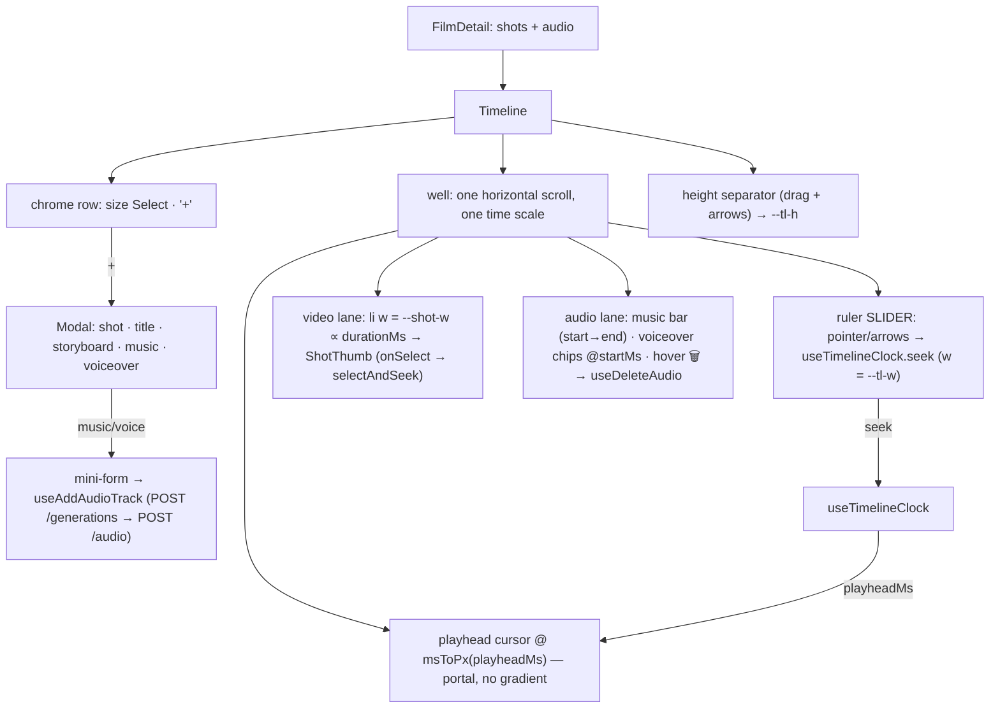

# Timeline.tsx — AI component doc

> AI-facing sidecar for `Timeline.tsx`. Created 2026-07-09. Keep this in sync with the code on every change.

## Purpose

The TRACKS panel (v7): a real edit-bay timeline at the bottom of the editor.
Three horizontal layers share ONE time scale (`PX_PER_SEC = 24`) inside one
horizontally-scrolling well: a RULER (second ticks, labels every 5s), the VIDEO
LANE (shot tiles as wide as their duration), and the AUDIO LANE (music beds as
bars to the film's end, voiceovers as chips at their exact start offset,
hover-delete). Since v8 (NLE Phase 1) the ruler is a SCRUB SLIDER, a portal
PLAYHEAD cursor rides over the lanes at the clock's position, and a tile click
SEEKS to that shot's start as well as selecting it — all driven by the shared
`useTimelineClock`. Phase 2 makes the scale a store-owned `zoom` (px/sec) with a
zoom-in/out/fit toolbar, m:ss ruler timecodes at a zoom-chosen interval, and
auto-scroll that follows the playhead during playback. Authoring — footage, title card, storyboard, and now MUSIC and
VOICEOVER — lives behind one "+" dialog whose TRIGGER is a dashed icon+label
tile (`AddTile`) riding the video lane after the last shot (alone next to the
empty hint on a shotless film). The panel wears NO chrome row since 2026-07-17:
no «Таймлайн» title, no size Select — strip height is the drag/keyboard
separator only (default 64px).

## What it does (for an AI reader)

- Responsibilities: own the tracks layout + time scale, the strip HEIGHT
  (`--tl-h`), the "+" dialog (incl. the audio mini-forms ported from the
  retired `AudioTracks` card), shot CRUD/reorder, audio track add/delete; lift
  selection to the editor.
- Public API / exports: `Timeline`, `TimelineProps` (`film: FilmDetail` —
  shots AND audio, `audioModels: CatalogAudioModel[]`, `musicPrompt?`,
  `selectedShotId`, `onSelectShot`, `onOpenStoryboard`).
- Inputs → Outputs: `FilmDetail` → ruler + lanes on one clock; dialog actions →
  shot mutations / `useAddAudioTrack` (generation POST + track link, one
  charged action); lane hover-delete → `useDeleteAudio`; ruler scrub / tile
  click → `useTimelineClock.seek` (playhead + preview follow).
- Seek surfaces (v8): the ruler `role="slider"` (pointer down/move + Arrow/Home/
  End) seeks the clock; `selectAndSeek` fires `onSelectShot` AND
  `seek(shotStartMs(shots, id))`; the playhead cursor renders at
  `msToPx(playheadMs, PX_PER_SEC)`. Seek clamps to the film's REAL length
  (`totalDurationMs`), so a click in the ruler's padded tail parks on the last
  frame. NO pointer capture (Phase-1 seam; jsdom lacks it too).
- CSS contract: the scroll body publishes `--tl-h` (tile height) and `--tl-w`
  (total width = totalSec × PX_PER_SEC); each shot `<li>` carries `--shot-w`
  (duration-proportional, min 56px). ShotThumb fills its slot (`w-full`).
- Side effects: `useAddShot`, `useDeleteShot`, `useReorderShots`,
  `useAddAudioTrack`, `useDeleteAudio`. Local UI state: `isAddOpen`,
  `addView: 'menu' | 'music' | 'voiceover'`, audio form fields, `tileHeight`,
  drag origin.

## Dependencies

- Imports: `react`, `react-i18next`, contracts (`AudioKind`,
  `CatalogAudioModel`, `FilmDetail`, `Shot`, `StyleId`), `shared/ui` (`Button`,
  `Card`, `Modal`, `Select`), `../model/audioApi`, `../model/shotsApi`,
  `../model/timelineClock` (`useTimelineClock`), `../model/timelineGeometry`
  (`msToPx`, `pxToMs`, `totalDurationMs`, `rulerTicks`, `formatTimecode`,
  `followScroll`, `shotWidthPx`, `splitTargetAt`), `../model/shotsApi` (adds
  `useSplitShot` — Phase 4), `../model/useShotDrag` (`useShotDrag` — Phase 3),
  `../model/voiceoverApi` (`shotStartMs`), `ShotThumb`, `ShotTileAffordances`,
  `TimelineToolbar` (zoom + split cluster — Phase 4), icons (`MicIcon`,
  `MusicIcon`, `PlusIcon`, `StoryboardIcon`, `TextCardIcon`, `TrashIcon`; the zoom
  icons moved into `TimelineToolbar`).
- Used by: `FilmEditor` (bottom of the pinned column; the composer floats OVER
  it as a fixed dock since 2026-07-17).
- Tested by: `Timeline.test.tsx` (dialog flow incl. the music form → POST,
  rail purity — the AddTile is a SIBLING of the shot `<ul>`, listitems stay
  "the shots" — audio lane render + delete, resize via keyboard separator,
  storyboard handoff; v8 playhead & seek — tile click seeks + selects, ruler
  pointer scrub, keyboard nudge, read back via the slider's `aria-valuenow`).

## Diagram

## Key decisions / gotchas

- **Proportional width is what makes it a timeline:** a 10s beat visibly costs
  twice a 5s one. The three layers share one scroll container and one scale so
  they can never drift apart.
- **Sound is a track, not a sidebar (v7):** the «Звук» card is gone; the audio
  lane sits directly beneath the footage on the same clock. A music bed's real
  length lives in the media (unknown client-side) → its bar runs to the film's
  end; voiceover chips sit at the offset they will actually play. Deleting is
  in place (hover/focus reveal, same pointer-events contract as the thumbs).
- **The "+" dialog's audio rows switch to a mini-form** instead of closing —
  Generate is ONE charged action (audio generation + track link,
  `useAddAudioTrack`). Reopening always starts at the menu (`closeAdd` resets).
- The total is a SIMPLE duration sum — crossfade overlap is a render subtlety,
  not a lane concern; min 8s keeps the ruler visible on an empty film.
- Reorder still swaps ids and POSTs the full order; the audio lane is NOT
  inside the shots `<ul>` (rail purity tests hold).
- NOT YET: dragging tracks horizontally (audio `startMs` has no PATCH endpoint)
  — the next honest step for "переставь звук мышкой".

### 2026-07-22 — v8 NLE Phase 1: playhead + seek
The tiles, the ruler and a new playhead cursor all hang off the singleton
`useTimelineClock` (shared with `PreviewPlayer`). The ruler became a
`role="slider"` scrub surface (pointer down = jump, drag while `buttons !== 0`,
Arrow/Home/End keyboard) exposing the position as TIME in `aria-valuenow`; a tile
click now `selectAndSeek`s (composer AND playhead jump — selection unifies with
the playhead, per the ADR); the cursor is a thin `bg-portal` line at
`msToPx(playheadMs, PX_PER_SEC)` offset by the `p-2` padding (`calc(0.5rem + …)`).
Seeks clamp to the film's real length so a click in the padded tail parks on the
last frame. No pointer capture yet (a drag leaving the ruler just stops).

### 2026-07-22 — v8 NLE Phase 2: zoom + scroll + ruler ticks
The `PX_PER_SEC` module constant is GONE — the scale is now `zoom` (px/sec) read
from `useTimelineClock`; every mapping (`--tl-w`, `--shot-w`, `leftPxOf`, the
cursor, the ruler) multiplies by `zoom`, so one number drives them all. A compact
right-aligned ZOOM TOOLBAR (hairline `size-7` tool buttons — `ZoomOutIcon` /
`ExpandIcon` fit / `ZoomInIcon`, a `role="group"`) calls the store's `zoomOut` /
`zoomIn`, and `handleFit` MEASURES `scrollRef.current.clientWidth` and passes it to
`fitToWindow` (the store stays DOM-free). The ruler ticks are `rulerTicks(totalSec,
zoom)` labelled with `formatTimecode` (m:ss) at a zoom-chosen interval (denser
zoomed in). The `overflow-x-auto` well carries `scrollRef`; an effect gated on
`isPlaying` uses the pure `followScroll` to keep the playhead in view during
playback (a manual scroll while paused is respected — the effect no-ops). This is
the toolbar/ruler wiring; the clamp/fit math and tick/follow decisions are pinned
in the store + geometry tests, the toolbar wiring + labels in `Timeline.test.tsx`.
NOT in scope (documented seams): audio-track mixing on the playhead (Phase 2b) and
trim/split/drag (Phase 3). The 56px tile-width floor is kept for clickability — a
small cosmetic divergence from true scale only at extreme zoom-out; the ruler +
cursor stay on the exact `zoom` mapping.

### 2026-07-22 — v8 NLE Phase 3: trim + drag-reorder + snapping
On-timeline editing via the EXISTING endpoints. The `useShotDrag` hook (given
`filmId`, `shots`, `zoom`, `playheadMs`, `laneRef`) owns the pointer session and
commits through `useUpdateShot` (trim → PATCH `{trimStartMs, durationMs}`) and
`useReorderShots` (drag → POST the moved id list). Per tile the lane `<li>` is now
`group relative` and renders `ShotTileAffordances` (left/right trim edges + a
reorder grip) beside `ShotThumb`; the slot width (`--shot-w = shotWidthPx(...)`)
follows the LIVE `drag.trimPreview` while an edge is dragged; a green DROP
indicator (`bg-glow-green`, distinct from the portal playhead) marks the target
slot during a reorder (x summed from `shotWidthPx` + `LANE_GAP_PX`, measured from
the `laneRef` `<ul>` origin — the same origin the reorder hit-test uses). All drag
math is pure in `timelineGeometry` (`windowFromEdge`, `snapMs`, `clipBoundariesMs`,
`dropIndexForX`, `moveItem`, `shotWidthPx`); the component just wires it. Trim/
reorder snap to clip boundaries + the playhead within `SNAP_PX`. Tests:
geometry (pure) + `Timeline.test.tsx` wiring (drag → PATCH/reorder, no listener
leak). DEFERRED (reported): split-at-playhead (composable from addShot+updateShot+
reorder — no new endpoint — Phase 3b) and audio waveforms.

### 2026-07-22 — v8 NLE Phase 4: split button + keyboard (+ toolbar extraction)
The zoom cluster moved into a new `TimelineToolbar` (which also holds the Phase-4
SPLIT scissors), so Timeline SHRANK (731 → 710) while gaining the feature. Timeline
computes the split target (`splitTargetAt(shots, playheadMs)`) and enables the
scissors only when it is the SELECTED shot (`canSplit`); `handleSplit` fires
`useSplitShot` (POST `/shots/:id/split { atMs }`). The editor's KEYBOARD lives in
`useTimelineKeys` (mounted in `FilmEditor`, not here — keyboard is editor-wide);
the S key there splits the shot UNDER the playhead regardless of selection. Both
share the pure `splitTargetAt`. Test: `Timeline.test.tsx` (button wiring + atMs +
disabled-on-boundary) and `useTimelineKeys.test.tsx`.

> ⚠️ FILE SIZE: Timeline.tsx is ~710 lines, still over the 500-line guideline —
> PRE-EXISTING (679 before Phase 3, from the v7 tracks + the "+" dialog). Phases
> 3–4 NET-REDUCED it via extractions (`useShotDrag`, `ShotTileAffordances`,
> `TimelineToolbar`, `useTimelineKeys`). The remaining bulk is the "+" dialog Modal
> — a follow-up should extract `AddTrackDialog`; NOT done here to avoid refactoring
> the heavily-tested authoring flow in the same pass as a feature.

### 2026-07-20 — the audio lane reports LIVE status, and the form reports failure

Two additions, both consequences of the same server change: `films/service.ts
addAudio` no longer rejects a still-processing generation. It had to stop —
audio is async (202 `processing`), so the gate made the client's
create-then-attach flow impossible and voiceover/music attachment failed 100% of
the time, **after** charge-at-submit had taken the credits.

- **`useAudioGenerations` drives a per-track status chip.** A track may now be
  attached while its clip is still rendering, so the lane must say so. Pending =
  dashed border + reduced opacity + the word; failed = the word and the danger
  tint OVERRIDING the kind colour (a broken track is a blocker, not a red music
  track); ready = no chip at all, because a badge on every finished track is
  noise on a lane that is mostly finished tracks. Status is never colour-only
  (design.md §8) — the WORD carries it. A `title` explains the consequence:
  pending delays the export, failed stops it (`buildPlan` refuses either).
  **This visibility is what replaces the removed server guard** — pending became
  legal, so it had to become legible.
- **The audio mini-form now renders an error.** It previously had none: a failed
  attach just stopped the spinner and left the dialog sitting there, which is how
  the attach bug stayed invisible. Localized through `errorCodeMessageKey`; the
  server's own words never reach the screen. A non-`ApiClientError` falls back to
  `internal_error` rather than silence.
- The `undefined` (not-yet-polled) status deliberately shows NO word — guessing
  "rendering" before the poll answers would be a claim, not a status.

## Commits

- _no commit yet (v7 rework)_
