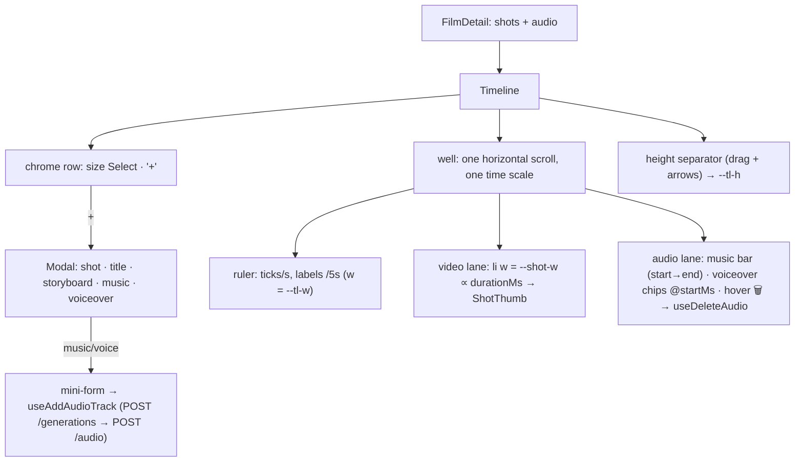

# Timeline.tsx — AI component doc

> AI-facing sidecar for `Timeline.tsx`. Created 2026-07-09. Keep this in sync with the code on every change.

## Purpose

The TRACKS panel (v7): a real edit-bay timeline at the bottom of the editor.
Three horizontal layers share ONE time scale (`PX_PER_SEC = 24`) inside one
horizontally-scrolling well: a RULER (second ticks, labels every 5s), the VIDEO
LANE (shot tiles as wide as their duration), and the AUDIO LANE (music beds as
bars to the film's end, voiceovers as chips at their exact start offset,
hover-delete). Authoring — footage, title card, storyboard, and now MUSIC and
VOICEOVER — lives behind one "+" dialog. Strip height is user-controlled
(size Select + drag separator).

## What it does (for an AI reader)

- Responsibilities: own the tracks layout + time scale, the strip HEIGHT
  (`--tl-h`), the "+" dialog (incl. the audio mini-forms ported from the
  retired `AudioTracks` card), shot CRUD/reorder, audio track add/delete; lift
  selection to the editor.
- Public API / exports: `Timeline`, `TimelineProps` (`film: FilmDetail` —
  shots AND audio, `audioModels: CatalogAudioModel[]`, `musicPrompt?`,
  `selectedShotId`, `onSelectShot`, `onOpenStoryboard`).
- Inputs → Outputs: `FilmDetail` → ruler + lanes on one clock; dialog actions →
  shot mutations / `useAddAudioTrack` (generation POST + track link, one
  charged action); lane hover-delete → `useDeleteAudio`.
- CSS contract: the scroll body publishes `--tl-h` (tile height) and `--tl-w`
  (total width = totalSec × PX_PER_SEC); each shot `<li>` carries `--shot-w`
  (duration-proportional, min 56px). ShotThumb fills its slot (`w-full`).
- Side effects: `useAddShot`, `useDeleteShot`, `useReorderShots`,
  `useAddAudioTrack`, `useDeleteAudio`. Local UI state: `isAddOpen`,
  `addView: 'menu' | 'music' | 'voiceover'`, audio form fields, `tileHeight`,
  drag origin.

## Dependencies

- Imports: `react`, `react-i18next`, contracts (`AudioKind`,
  `CatalogAudioModel`, `FilmDetail`, `StyleId`), `shared/ui` (`Button`, `Card`,
  `Modal`, `Select`), `../model/audioApi`, `../model/shotsApi`, `ShotThumb`,
  icons (`MicIcon`, `MusicIcon`, `PlusIcon`, `StoryboardIcon`, `TextCardIcon`,
  `TrashIcon`).
- Used by: `FilmEditor` (bottom workbench, under the composer).
- Tested by: `Timeline.test.tsx` (dialog flow incl. the music form → POST,
  rail purity, audio lane render + delete, resize via select + keyboard,
  storyboard handoff).

## Diagram

## Key decisions / gotchas

- **Proportional width is what makes it a timeline:** a 10s beat visibly costs
  twice a 5s one. The three layers share one scroll container and one scale so
  they can never drift apart.
- **Sound is a track, not a sidebar (v7):** the «Звук» card is gone; the audio
  lane sits directly beneath the footage on the same clock. A music bed's real
  length lives in the media (unknown client-side) → its bar runs to the film's
  end; voiceover chips sit at the offset they will actually play. Deleting is
  in place (hover/focus reveal, same pointer-events contract as the thumbs).
- **The "+" dialog's audio rows switch to a mini-form** instead of closing —
  Generate is ONE charged action (audio generation + track link,
  `useAddAudioTrack`). Reopening always starts at the menu (`closeAdd` resets).
- The total is a SIMPLE duration sum — crossfade overlap is a render subtlety,
  not a lane concern; min 8s keeps the ruler visible on an empty film.
- Reorder still swaps ids and POSTs the full order; the audio lane is NOT
  inside the shots `<ul>` (rail purity tests hold).
- NOT YET: dragging tracks horizontally (audio `startMs` has no PATCH endpoint)
  — the next honest step for "переставь звук мышкой".

## Commits

- _no commit yet (v7 rework)_
