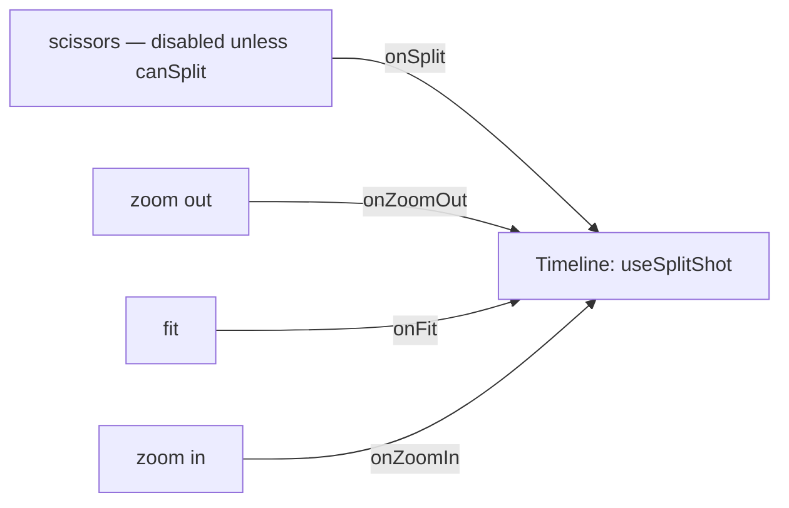

# TimelineToolbar.tsx — AI component doc

> AI-facing sidecar for `TimelineToolbar.tsx`. Created 2026-07-22 (NLE Phase 4). Keep in sync with the code on every change.

## Purpose

The timeline's compact tool cluster — SPLIT (Phase 4) + ZOOM out/fit/in (Phase 2).
Extracted from `Timeline.tsx` so that file stops growing. Purely presentational:
every action and the `canSplit` gate is decided by `Timeline` and passed in.

## What it does (for an AI reader)

- Responsibilities: render the right-aligned hairline tool buttons; nothing else.
- Public API / exports: `TimelineToolbar`, `TimelineToolbarProps =
  { onZoomIn, onZoomOut, onFit, onSplit, canSplit }`.
- Inputs → Outputs: a click → the matching callback; `canSplit=false` disables the
  scissors (a boundary/no-selection has nothing to cut).
- Side effects: none (Timeline owns the clock + mutations).

## Dependencies

- Imports: `react-i18next`, `./icons` (`ScissorsIcon`, `ExpandIcon`, `ZoomInIcon`,
  `ZoomOutIcon`).
- Used by: `Timeline` (rendered above the tracks well).

## Diagram

## Key decisions / gotchas

- **Presentational only** — the split target (selected shot + playhead → atMs) and
  every action live in `Timeline`; this keeps the toolbar a pure view and the
  extraction net-negative on `Timeline`'s line count.
- **Scissors disabled = disabled `<button>`** (40% dim), never hidden — the control
  stays discoverable; it just can't fire on a boundary or with no selection.
- **The ONE chrome the panel wears** — the "+"/size row was retired (owner
  2026-07-17); zoom + split are functional NLE controls, distinct from that.

## Commits

- _no commit yet_
