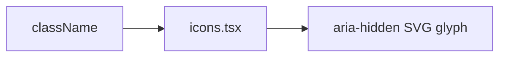

# icons.tsx — AI component doc

> AI-facing sidecar for `icons.tsx`. Created 2026-07-09. Keep this in sync with the code on every change.

## Purpose

Inline `currentColor` SVG glyphs for the CinemaStudio surfaces — one family drawn
on a 24-unit grid with a 1.5 stroke, so timeline/render/audio control rows never
look ragged. Never OS emoji (they paint their own palette and break the triad).

## What it does (for an AI reader)

- Responsibilities: presentational icons only, no logic.
- Public API / exports: `PlayIcon`, `PauseIcon`, `PlusIcon`, `TrashIcon`,
  `DownloadIcon`, `ChevronLeftIcon`, `ChevronRightIcon`, `SparkIcon`,
  `TextCardIcon`, `MusicIcon`, `MicIcon`, `StoryboardIcon` — each `{ className?: string }`.
- Inputs → Outputs: className → an `aria-hidden` SVG.
- Side effects: none.

## Dependencies

- Imports: none (self-contained SVG).
- Used by: `Timeline`, `ShotThumb`, `ShotInspector`, `PreviewPlayer`, `RenderBar`,
  `AudioTracks`, `FilmCard`, `FilmEditorHeader`, `CinemaLibrary`.

## Diagram

## Key decisions / gotchas

- `aria-hidden` throughout — the button/label carries the accessible name.
- Play/Pause are filled glyphs; the rest are 1.5-stroke line icons.

## Update 2026-07-15 — composer icons
- Added `PaperclipIcon` (attach a reference — the docked shot composer's cast
  tool) and `ExpandIcon` (open the composer's full-settings drawer), same
  24-unit grid / 1.5 stroke as the rest of the set.

## Commits

- _no commit yet_
