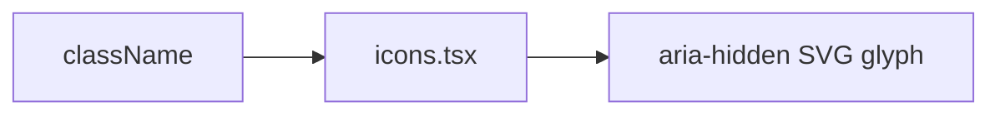

# icons.tsx — AI component doc

> AI-facing sidecar for `icons.tsx`. Created 2026-07-09. Keep this in sync with the code on every change.

## Purpose

Inline `currentColor` SVG glyphs for the CinemaStudio surfaces — one family drawn
on a 24-unit grid with a 1.5 stroke, so timeline/render/audio control rows never
look ragged. Never OS emoji (they paint their own palette and break the triad).

## What it does (for an AI reader)

- Responsibilities: presentational icons only, no logic.
- Public API / exports: `PlayIcon`, `PauseIcon`, `PlusIcon`, `TrashIcon`,
  `DownloadIcon`, `ChevronLeftIcon`, `ChevronRightIcon`, `SparkIcon`,
  `TextCardIcon`, `MusicIcon`, `MicIcon`, `SpeakerIcon`, `PersonIcon`,
  `PaperclipIcon`, `ExpandIcon`, `ZoomInIcon`, `ZoomOutIcon`, `ScissorsIcon`,
  `PaletteIcon`, `FrameIcon`, `StoryboardIcon` — each `{ className?: string }`,
  except `FrameIcon`, which also takes the `ratio` it must draw.
- Inputs → Outputs: className → an `aria-hidden` SVG.
- Side effects: none.

## Dependencies

- Imports: none (self-contained SVG).
- Used by: `Timeline`, `ShotThumb`, `ShotInspector`, `PreviewPlayer`, `RenderBar`,
  `AudioTracks`, `FilmCard`, `CinemaEditorHeader`, `CinemaLibrary`.

## Diagram

## Key decisions / gotchas

- `aria-hidden` throughout — the button/label carries the accessible name.
- Play/Pause are filled glyphs; the rest are 1.5-stroke line icons.

## Update 2026-07-15 — composer icons
- Added `PaperclipIcon` (attach a reference — the docked shot composer's cast
  tool) and `ExpandIcon` (open the composer's full-settings drawer), same
  24-unit grid / 1.5 stroke as the rest of the set.

## Update 2026-07-22 — timeline zoom icons (Phase 2)
- Added `ZoomInIcon` / `ZoomOutIcon` (a magnifier with a + / −) for the Timeline's
  zoom cluster; `ExpandIcon` doubles as the "fit to window" control. Same grid +
  stroke.

## Update 2026-07-22 — split icon (Phase 4)
- Added `ScissorsIcon` (two blades + a cut line) for the timeline's split-at-
  playhead control. Same 24-grid / 1.5 stroke.

## Update 2026-07-24 — make-character icon
- Added `PersonIcon` (a head + shoulders bust) for the "make a character from this
  reference" affordance on an attached shot-reference thumbnail. Same 24-grid /
  1.5 stroke as the set.

## Update 2026-08-02 — composer look chips (palette + frame)
- Added `PaletteIcon` (the shot's STYLE — a painter's palette, deliberately not a
  wand: `SparkIcon` already means "generate") and `FrameIcon` for the new
  icon-only look controls in the composer's drawer (`PresetPickers`).
- `FrameIcon` is the one icon in this file that is NOT purely decorative in the
  usual sense: it takes `ratio: '16:9' | '1:1' | '9:16' | null` and DRAWS that
  rectangle, so an icon-only trigger still shows its own value with no text
  label. `null` (inherit the film canvas) draws the frame DASHED — a shape that
  is not this shot's own decision. Rect geometry is hand-tuned per ratio rather
  than computed, because a computed 9:16 box is an illegible sliver at 16px.

## Commits

- 373b51f 2026-07-23 feat(cinema,assets3d,prompt): NLE editor + client export, 3D assets wizard, prompt enhancer, session fixes
