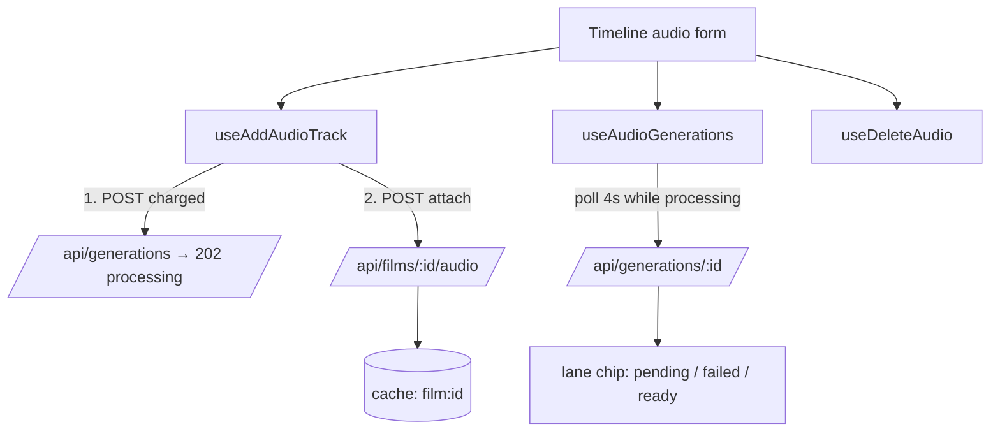

# audioApi.ts — AI component doc

> AI-facing sidecar for `audioApi.ts`. Created 2026-07-09. Keep this in sync with the code on every change.

## Purpose

Server-state for a film's audio tracks: generate-and-attach a music bed or voiceover,
remove a track, and read the LIVE status of every attached track. The audio generation
itself rides the ordinary generation lifecycle (charge-at-submit, 202 `processing`);
these hooks link it to the film and then keep the lane truthful about it.

## What it does (for an AI reader)

- Responsibilities: attach/remove tracks, and poll each track's cited generation so the
  timeline can show pending/failed/ready.
- Public API / exports:
  - `useAddAudioTrack()` — the primary path: POST `/api/generations` (charged) then POST
    `/api/films/:filmId/audio`, in one action. Invalidates `['film', id]` + `['me']`.
  - `useAddAudio()` — attach an ALREADY-EXISTING generation id
    (`AddFilmAudioInput` → `FilmAudio`). **Currently unused — see gotchas.**
  - `useDeleteAudio()` — DELETE `/api/films/:filmId/audio/:audioId`.
  - `useAudioGenerations(generationIds)` → `Record<string, Generation>` — live status of
    every track on the lane, over the shared `['generation', id]` cache.
- Inputs → Outputs: variables carry `filmId` (+ `input`/`audioId`/prompt/model); the poll
  takes a list of generation ids and returns a lookup.
- Side effects: network; charges credits (`useAddAudioTrack`); invalidates
  `['film', filmId]` and `['me']`; polls every 4s while a track is processing.

## Dependencies

- Imports: `@tanstack/react-query` (`useMutation`, `useQueries`, `useQueryClient`),
  contract types, `shared/libs/apiClient`, `filmKey` from `./filmsApi`.
- Used by: `Timeline.tsx` (the audio lane + the "+" dialog's audio mini-form).

## Diagram

## Key decisions / gotchas

- Audio is NOT a new subsystem (ADR §1): a track references a `generation.type = 'audio'`
  row. These hooks never render audio — they wire the reference and read its status.
- **`useAudioGenerations` carries a `refetchInterval`; `useShotGenerations`
  (`shotGeneration.ts:104-117`) deliberately does not.** That is not an inconsistency: on
  the video lane the mounted `ShotThumb`s own the polling and the batch only reads the
  fresher answer, whereas on the audio lane there is no second poller — this IS the only
  one. Without the interval a processing track would never be seen to finish.
- The interval stops on any terminal status, and stops on a FIRST-poll error (data still
  undefined) rather than hammering a failing endpoint every 4s.
- **Why the status poll exists at all (2026-07-20):** `films/service.ts addAudio` no longer
  rejects a still-processing generation. It had to stop, because audio is async and the
  gate made the create-then-attach flow impossible — voiceover and music attachment failed
  100% of the time, after charging. Attaching a pending track is now legal, so the safety
  the gate provided is replaced by MAKING PENDING VISIBLE. This hook is that mechanism.
- **`useAddAudio` is intentionally kept although nothing calls it.** It is the exact
  "attach an existing generation" seam a future library-picker needs — and specifically the
  recovery path for users who hit the pre-2026-07-20 bug and own paid-for mp3s with no
  track. Deleting it would remove the seam immediately before it is wanted. Do not assume
  it is wired: it is not.

## Commits

- _no commit yet_
