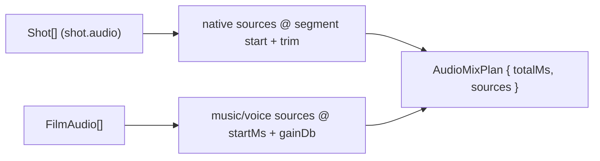

# audioMixPlan.ts — AI model doc

> AI-facing sidecar for `audioMixPlan.ts`. Created 2026-07-23 (client-side export). Keep in sync with the code on every change.

## Purpose

The PURE audio spec for the client export — the browser's `OfflineAudioContext`
mix consumes this list. Mirrors render.ts §"Audio": clip NATIVE soundtracks (a
shot generated with sound) at their crossfade-aware start + trim, plus the film's
music/voiceover tracks at their offset with gain, capped to the video length.

## What it does (for an AI reader)

- Responsibilities: enumerate every audio source with its timeline placement.
- Public API / exports: `audioMixPlan(shots, filmAudio)` → `AudioMixPlan
  { totalMs, sources: AudioSource[] }`; types `AudioSource`
  (`{ kind: 'native'|'music'|'voiceover', generationId, timelineStartMs,
  sourceStartMs, durationMs|null, gainDb }`), `AudioSourceKind`.
- Inputs → Outputs: `Shot[]` + `FilmAudio[]` → the source list + `totalMs` cap.
- Side effects: NONE (pure).

## Dependencies

- Imports: contract `FilmAudio`, `Shot`; `./exportPlan` (`buildSegmentTimeline` for
  crossfade-aware native starts — shares the video fold so sound and picture agree).
- Used by: `runFilmExport`/the browser audio mixer. Module-internal.

## Diagram

## Key decisions / gotchas

- **Shares `buildSegmentTimeline`** so a native soundtrack starts at the exact
  crossfade-aware offset the picture does — sound/image lockstep through any mix of
  cuts and fades (the render.ts guarantee).
- **`durationMs` null for film tracks** — their real length is in the media
  (unknown client-side); the mixer plays natural length capped to `totalMs`.
- **Native gating is `shot.audio && generationId`** — the pure plan lists
  candidates; the browser adapter is the FINAL guard (skips a clip whose decoded
  media has no audio track, mirroring the server's "don't map a missing stream").
- **`gainDb`** is carried verbatim (dB); the mixer converts dB→linear amplitude.

## Commits

- _no commit yet_
