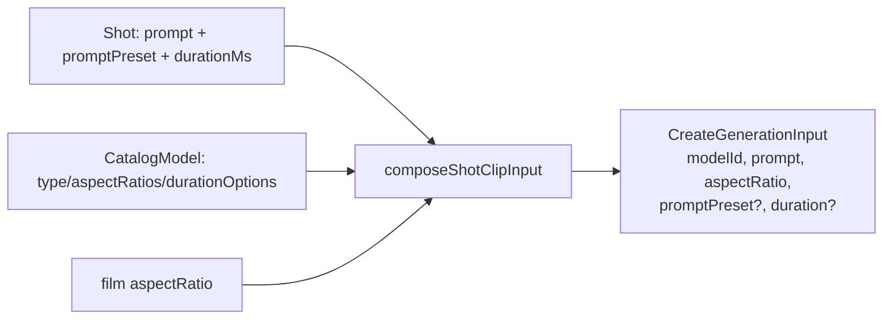

# composeShotClipInput.ts — AI component doc

> AI-facing sidecar for `composeShotClipInput.ts`. Created 2026-07-09. Keep this in sync with the code on every change.

## Purpose

The single, pure translation from a timeline `Shot` + a chosen `CatalogModel`
into the `POST /api/generations` body that renders that shot's clip. It is the
one place CinemaStudio decides what the model is asked to make.

## What it does (for an AI reader)

- Responsibilities: forward the shot's own `prompt` and its **structured**
  `promptPreset` untouched (the server composes — ADR §3, never flatten
  fragments into `prompt`); resolve the request `aspectRatio` against the film
  canvas; snap a video model's `duration` to an offered option.
- Public API / exports:
  - `composeShotClipInput(shot, model, filmAspect): CreateGenerationInput`
  - `nearestDuration(options, seconds): number`
- Inputs → Outputs: `(Shot, CatalogModel, AspectRatio)` → `CreateGenerationInput`.
- Side effects: none — pure, synchronous, no I/O.

## Dependencies

- Imports: types only from `@opencreate/contracts`
  (`AspectRatio`, `CatalogModel`, `CreateGenerationInput`, `Shot`).
- Used by: `shotGeneration.ts` (`useGenerateShotClip` builds the request body
  from it); tested by `composeShotClipInput.test.ts`.

## Diagram

## Key decisions / gotchas

- The preset stays **structured** to the wire: `prompt` is exactly the user's
  words, `promptPreset` travels as the id object. The server composes so
  "Regenerate"/"Edit" read back what the user wrote (ADR §3).
- `promptPreset` key is OMITTED when the shot has none — `exactOptionalPropertyTypes`
  forbids `promptPreset: undefined`, and an absent preset composes to the plain
  prompt anyway.
- Aspect: the film canvas wins when the model supports it, else the model's first
  ratio (`noUncheckedIndexedAccess` fallback → `filmAspect`). The render scales/
  pads every shot to the canvas regardless.
- `duration` is video-only; snapped to the nearest `durationOptions` value because
  a video model prices per that list and rejects arbitrary seconds.

## Commits

- _no commit yet_
