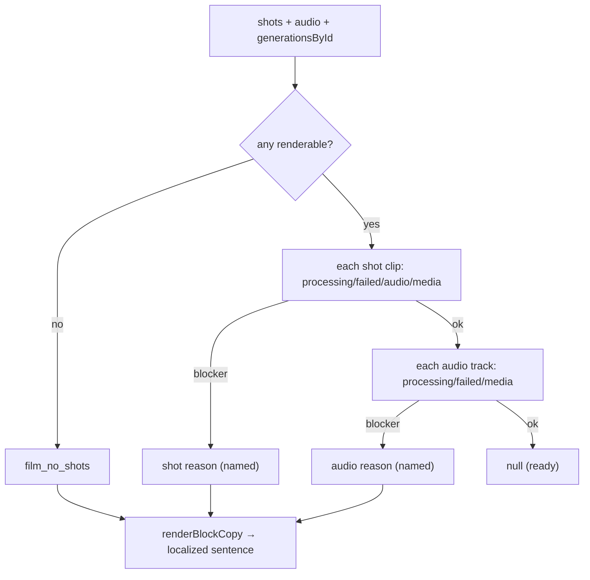

# computeExportBlock.ts — AI model doc

> AI-facing sidecar for `computeExportBlock.ts`. Created 2026-07-23 (client-side export). Keep in sync with the code on every change.

## Purpose

CLIENT-side export validation — the value the retired server `renderBlockReason`
gave us, moved into the browser. Computes the FIRST blocking reason from the shots
+ the generation cache (a shot still generating/failed/audio/medialess, an unready
audio track, no renderable shots) and reuses `renderBlockCopy` for the exact
localized, subject-naming sentence. Pure.

## What it does (for an AI reader)

- Responsibilities: decide whether the film can export, and if not, WHY (named).
- Public API / exports: `computeExportBlock(shots, audio, generationsById, t)` →
  `RenderBlock | null` (`{ message, subjectKind, subjectId }`, null = ready).
- Inputs → Outputs: shots + `FilmAudio[]` + `Record<genId, Generation>` → the block
  or null.
- Side effects: NONE (pure).

## Dependencies

- Imports: contract `FilmAudio`/`Generation`/`RenderBlockReason`/`Shot`,
  `shared/libs/apiClient` (`ApiErrorDetail` type), `./renderBlockCopy`
  (`renderBlockCopy`, `RenderBlock`).
- Used by: `useExportController` (gates `startExport`), which feeds `RenderBar`.

## Diagram

## Key decisions / gotchas

- **Reuses `renderBlockCopy`** by building a `renderBlockReason`-shaped
  `ApiErrorDetail` — the copy path never forks from the (dormant) server one, so
  the sentences + subject naming (Shot 4 / Music / Line · beat 3) stay identical.
- **Unresolved generation (not in cache) → "still generating"** — the honest wait
  answer while the poll catches up, not a false "missing".
- **A title/empty shot renders a slate** — skipped (not a blocker); the
  `film_no_shots` guard already ensured at least one renderable shot exists.
- **First blocker wins** — shots before audio, in order, so the named subject is
  the one to fix first.

## Commits

- _no commit yet_
