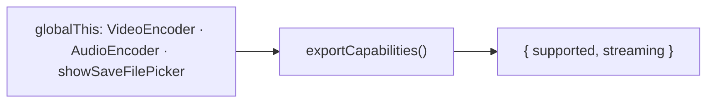

# exportCapabilities.ts — AI model doc

> AI-facing sidecar for `exportCapabilities.ts`. Created 2026-07-23 (client-side export). Keep in sync with the code on every change.

## Purpose

The client-export capability gate. WebCodecs (`VideoEncoder` + `AudioEncoder`) is
required to run the export at all; File System Access (`showSaveFilePicker`)
enables streaming to disk (flat memory), whose absence falls back to an in-memory
blob (long films degrade — Safari/Firefox). Pure detection so the UI gate + message
are testable by stubbing globals.

## What it does (for an AI reader)

- Responsibilities: feature-detect WebCodecs + File System Access.
- Public API / exports: `exportCapabilities()` → `{ supported, streaming }`;
  `isExportSupported()` → boolean; type `ExportCapability`.
- Inputs → Outputs: reads `globalThis` → the capability record.
- Side effects: NONE (reads globals only).

## Dependencies

- Imports: none.
- Used by: `useFilmExport` (gate the export action + choose the streaming vs blob
  sink), `RenderBar`/`FilmEditor` (calm unsupported message). Module-internal.

## Diagram

## Key decisions / gotchas

- **WebCodecs is the hard gate** — no `VideoEncoder`/`AudioEncoder` → `supported:
  false`, the UI offers a calm "not supported here" message (never a broken button).
- **Streaming ⊂ supported** — `streaming` is only true WITH WebCodecs; it selects
  the disk-stream sink (flat memory) vs the blob-download sink.
- **typeof-guarded** — jsdom/non-browser reads everything as absent instead of
  throwing, which is what makes the gate unit-testable via `vi.stubGlobal`.

## Commits

- _no commit yet_
