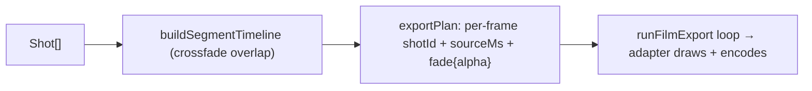

# exportPlan.ts — AI model doc

> AI-facing sidecar for `exportPlan.ts`. Created 2026-07-23 (client-side export). Keep in sync with the code on every change.

## Purpose

The PURE per-frame timeline for the client-side WebCodecs export — the tested
correctness core that re-implements the SERVER render's timeline math
(`apps/api/src/modules/films/render.ts`) so the browser mp4 matches ffmpeg's:
concat by order, per-shot trim, and crossfade OVERLAP (shortens the total; both
shots blended through the fade). No WebCodecs/canvas here.

## What it does (for an AI reader)

- Responsibilities: the output frame grid + each frame's shot/source-offset/fade.
- Public API / exports:
  - `EXPORT_FPS` (30, matches the server), `canvasFor(aspect)` (mirrors render.ts).
  - `buildSegmentTimeline(shots)` → `{ segments: SegmentSpan[], totalMs }` — the
    crossfade-aware fold (start offsets + overlap).
  - `exportPlan(shots, aspect, fps?)` → `ExportPlan { width, height, fps,
    frameCount, durationMs, frames: FramePlanEntry[] }`.
  - types `SegmentSpan`, `FramePlanEntry` (`{ frameIndex, timestampMicros, shotId,
    sourceMs, fade: { fromShotId, fromSourceMs, alpha } | null }`), `ExportPlan`.
- Inputs → Outputs: `Shot[]` + aspect → the frame plan the adapter renders.
- Side effects: NONE (pure).

## Dependencies

- Imports: contract `AspectRatio`, `Shot`.
- Used by: `runFilmExport` (walks `frames`), the browser adapter `drawFilmFrame`
  (renders each entry), `audioMixPlan` (shares `buildSegmentTimeline` for
  crossfade-aware native-audio starts). Module-internal.

## Diagram

## Key decisions / gotchas

- **Mirrors `render.ts` exactly** — the fold, the `CROSSFADE_FLOOR_MS` (= render's
  `-0.05s`) clamp, the canvas table, fps 30. A divergence here ships a client mp4
  that differs from the (dormant) server one.
- **Crossfade OVERLAPS** — unlike the preview's `timelineGeometry.clipAtMs` (simple
  concat, no overlap), the export total is shorter and has blend regions; that is
  why this has its own fold rather than reusing `clipAtMs`.
- **`sourceMs` = trimStartMs + timeline offset** — trim is baked into the seek the
  decoder uses; image/title shots ignore it.
- **Timestamps from the frame index** (µs), never a clock — deterministic encode
  (the `renderTurntable` invariant).
- **`fade`**: the INCOMING shot is `shotId` (drawn on top at `alpha`), the OUTGOING
  is `fade.fromShotId` (drawn beneath at full) — a linear cross-dissolve.

## Commits

- _no commit yet_
