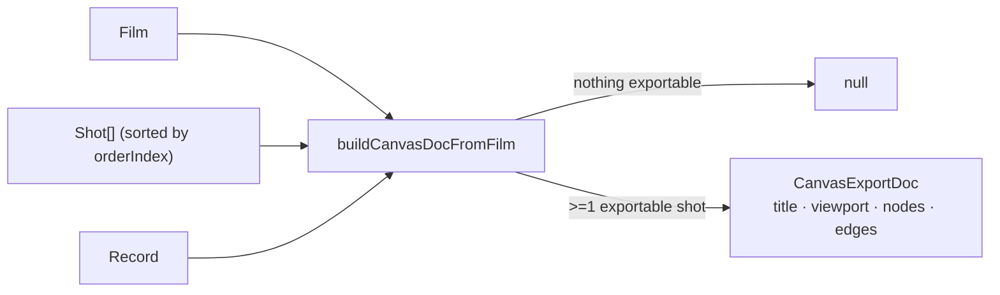

# exportToCanvas.ts — AI component doc

> AI-facing sidecar for `exportToCanvas.ts`. Created 2026-08-04. Keep this in sync with the code on every change.

## Purpose

The pure, ONE-OFF conversion from a finished film into a brand-new Canvas
document: one node per shot with playable footage (in order), chained by
sequential edges. This is a snapshot, not a sync — the produced canvas has no
live link back to the film that made it (owner-approved "Export to Canvas").

## What it does (for an AI reader)

- Responsibilities: filter `shots` down to the ones with a succeeded,
  media-bearing generation; sort by `orderIndex`; mint a `CanvasNode` per
  survivor (full `crypto.randomUUID()` id, `image`/`video` kind off the
  generation's `type`, `x = index * 320` layout, `config` seeded from the
  shot); chain `node[i] → node[i+1]` edges; build the canvas `title` (capped
  at the wire's 120-char limit).
- Public API / exports:
  - `buildCanvasDocFromFilm(film, shots, generationsById): CanvasExportDoc | null`
  - `type CanvasExportDoc = { title, viewport, nodes, edges }`
- Inputs → Outputs: `(Film, Shot[], Record<string, Generation>)` →
  `CanvasExportDoc` or `null` when nothing is exportable (every shot is a
  title card, unset, still processing, failed, or missing from the lookup) —
  the caller (`FilmEditor.tsx`) surfaces `null` as an error toast instead of
  creating an empty-but-valid canvas.
- Side effects: none — pure, synchronous. `crypto.randomUUID()` is the one
  platform call, same as `canvasStore.ts`'s `mintId`.

## Dependencies

- Imports: TYPES ONLY from `@opencreate/contracts` (`CanvasEdge`, `CanvasNode`,
  `CanvasViewport`, `Film`, `Generation`, `Shot`). Deliberately imports
  NOTHING from `modules/Canvas` — this file must stay testable standalone and
  must never grow a module dependency Cinema doesn't otherwise have.
- Used by: `FilmEditor.tsx` (`onExportToCanvas` handler, after resolving the
  film's cited generations via `useShotGenerations`); tested by
  `exportToCanvas.test.ts`.

## Diagram

## Key decisions / gotchas

- Exportability is THREE checks, all must hold: `generationId !== null`, the
  generation is present in `generationsById`, `status === 'succeeded'`, and
  `mediaUrls.length > 0`. Any miss silently drops the shot — there is no
  partial/placeholder node for a clip that isn't there.
- Node ids are FULL `crypto.randomUUID()` (36 chars), never shortened — see
  `canvasStore.ts.md`'s I1 fix-wave note: `canvas_node.id` is a GLOBAL primary
  key across every canvas's rows, so a truncated id is a cross-canvas
  collision waiting to 500.
- `config.duration` is DELIBERATELY never set. `shot.durationMs` is
  milliseconds up to 60000; `canvasNodeConfigSchema.duration` is INTEGER
  SECONDS 1-15. A naive `/1000` can land out of the schema's range and fail
  validation server-side at save time — omitting it is the only always-legal
  choice, and the node just gets no length opinion (same as a hand-placed one).
- `config.aspectRatio` = `shot.aspectRatio ?? film.aspectRatio` — same
  precedence `composeShotClipInput.ts` uses for generation requests.
- Title = `` `${film.title} — Canvas}` `` truncated to `createCanvasInputSchema`'s
  120-char cap, so a maximally-long film title never fails the create call.
- `resolveExportableShot` returns the shot ALONGSIDE its resolved generation
  (not just a boolean) so the node-building map never needs a `!` to re-look
  the generation up — the repo's "no `!`" rule stays satisfied through a type,
  not a runtime assertion.

## Commits

- _no commit yet_
