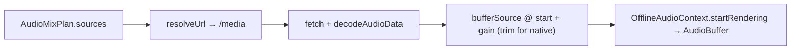

# filmExportAudio.ts — AI model doc

> AI-facing sidecar for `filmExportAudio.ts`. Created 2026-07-23 (client-side export). Keep in sync with the code on every change.

## Purpose

Mix the export's `AudioMixPlan` into ONE `AudioBuffer` with an
`OfflineAudioContext` — the browser counterpart of render.ts's `amix`. Each source
is fetched from /media, decoded, placed at its timeline start with its gain and
(native) trimmed to its window; rendered offline, capped to the film length.

> ⚠️ IN-BROWSER VERIFIED ONLY — jsdom has no Web Audio. The pure `audioMixPlan`
> this consumes is unit-tested; this render step is verified by a real-browser
> export.

## What it does (for an AI reader)

- Responsibilities: fetch + decode + place + gain every audio source → one buffer.
- Public API / exports: `mixExportAudio(plan, resolveUrl)` →
  `Promise<AudioBuffer | null>` (null when nothing was schedulable); type
  `ResolveMediaUrl = (generationId) => string | null`.
- Inputs → Outputs: an `AudioMixPlan` + a url resolver → a mixed `AudioBuffer`.
- Side effects: `fetch(/media)` per source; `OfflineAudioContext.decodeAudioData`
  + `startRendering`.

## Dependencies

- Imports: `./audioMixPlan` (type `AudioMixPlan`).
- Used by: `filmExporter` (`createFilmExportSink.addAudio`). Lives in the lazy
  export chunk.

## Diagram

## Key decisions / gotchas

- **A source that fails to decode is SKIPPED** (a silent shot / a fetch blip) — the
  final guard the pure plan defers to (a missing audio stream must not fail the
  export), mirroring the server's caution.
- **Native audio uses `start(when, offset, duration)`** — trimmed to the shot
  window; a film track uses `start(when, offset)` and plays its natural length,
  capped by the context's `length` (= `totalMs`).
- **`dbToGain`** converts the plan's dB to linear amplitude (render.ts's `volume`).
- **48kHz stereo** context — a fixed, safe mix rate; the encoder resamples as
  needed.

## Commits

- _no commit yet_
