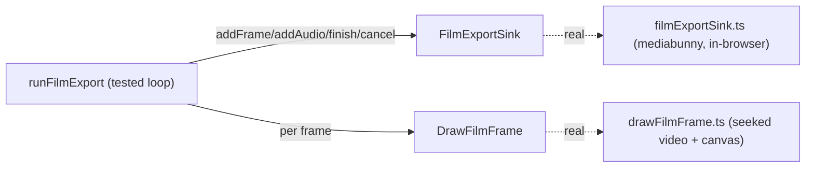

# filmExportPorts.ts — AI model doc

> AI-facing sidecar for `filmExportPorts.ts`. Created 2026-07-23 (client-side export). Keep in sync with the code on every change.

## Purpose

The port interfaces between the tested export orchestrator and the browser-only
encode (the `renderTurntable` `TurntableFrameSink` precedent). Interfaces so the
correctness loop is testable with fakes in jsdom, and the muxer/decoder stay
swappable. The real implementations live in a lazy chunk and are verified
in-browser, not vitest.

## What it does (for an AI reader)

- Responsibilities: define the encode SINK, the frame DRAW callback, and the sink
  FACTORY. Types only — no runtime.
- Public API / exports:
  - `FilmExportSink` — `{ addFrame(tsµs, durµs), addAudio(plan), finish() → Blob |
    null, cancel() }`.
  - `DrawFilmFrame` — `(entry) => Promise<void>` (decode + composite + title).
  - `FilmExportSinkFactory` — `(canvas, plan) => Promise<FilmExportSink>`.
- Inputs → Outputs: n/a (type declarations).
- Side effects: none.

## Dependencies

- Imports (type-only): `./audioMixPlan` (`AudioMixPlan`), `./exportPlan`
  (`ExportPlan`, `FramePlanEntry`).
- Used by: `runFilmExport` (consumes the sink + draw), `filmExportSink.ts` +
  `drawFilmFrame.ts` (implement them — the lazy browser chunk), `useFilmExport`.

## Diagram

## Key decisions / gotchas

- **Ports, not inlined** — jsdom has no WebCodecs/canvas; the loop's tests inject
  fakes for both the sink and the draw, so the correctness is covered without a
  browser (the `createMp4Sink` model).
- **`finish` → `Blob | null`** — Blob is the in-memory Safari/FF fallback; `null`
  means the mux streamed straight to disk (flat memory).
- **`addAudio` takes the whole `AudioMixPlan`** — the browser mixer owns the decode
  + `OfflineAudioContext` mix; the orchestrator just hands it the plan once.

## Commits

- _no commit yet_
