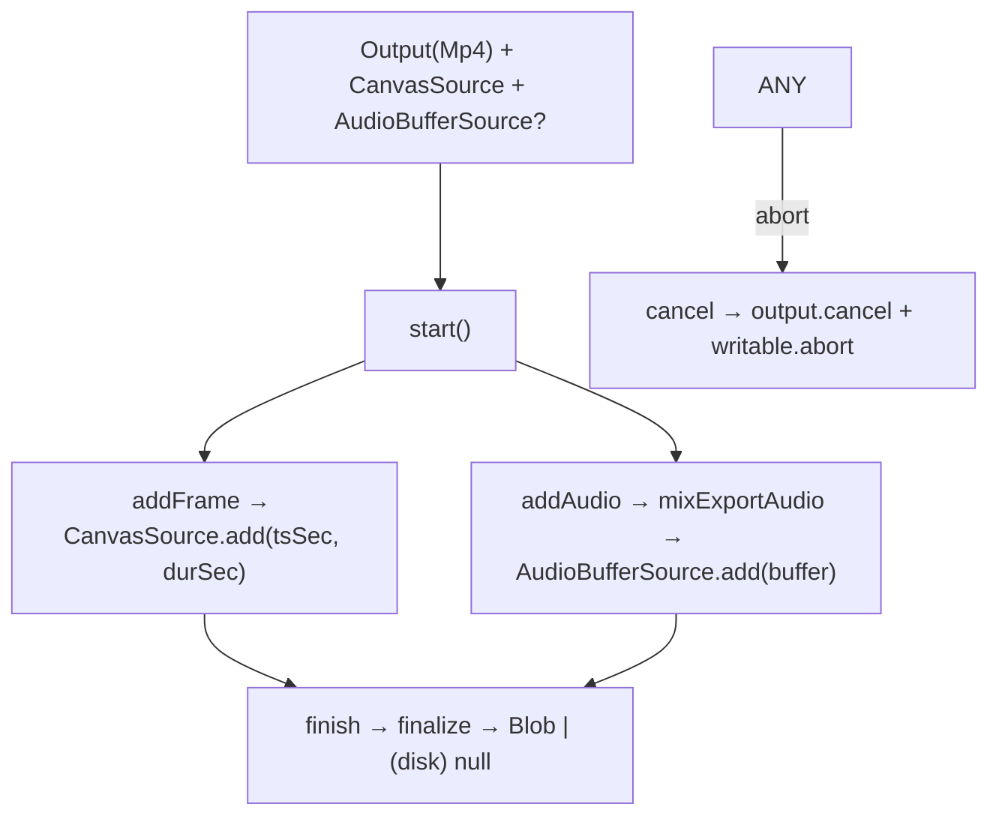

# filmExporter.ts — AI model doc

> AI-facing sidecar for `filmExporter.ts`. Created 2026-07-23 (client-side export). Keep in sync with the code on every change.

## Purpose

The REAL WebCodecs encode sink for the film export — mediabunny, mirroring
Studio3D's shipped `createMp4Sink`, extended to a film (video CanvasSource + audio
AudioBufferSource) with output either STREAMED to disk (File System Access → flat
memory) or an in-memory Blob (Safari/FF fallback).

> ⚠️ IN-BROWSER VERIFIED ONLY — cannot run in vitest (no WebCodecs/FS Access). The
> LOOP that uses it (`runFilmExport`) is unit-tested with a fake sink; this file is
> verified by a real-browser export. Blob path mirrors the shipped `createMp4Sink`;
> the StreamTarget + audio track are the new surface to check first.

## What it does (for an AI reader)

- Responsibilities: implement `FilmExportSink` (encode + mux + write).
- Public API / exports: `createFilmExportSink(canvas, plan, hasAudio, resolveUrl?)`
  → `FilmExportSink` (`addFrame`/`addAudio`/`finish`/`cancel`).
- Inputs → Outputs: canvas frames + the audio plan → an mp4 (Blob, or written to
  disk and `finish()` returns null).
- Side effects: WebCodecs encode; `showSaveFilePicker` + a `FileSystemWritableFile
  Stream` (streaming) or a `BufferTarget` (blob); the `mixExportAudio` decode/mix.

## Dependencies

- Imports: `mediabunny` (`Output`, `CanvasSource`, `AudioBufferSource`,
  `Mp4OutputFormat`, `BufferTarget`, `StreamTarget`, `QUALITY_HIGH`), `./exportPlan`,
  `./audioMixPlan` (types), `./filmExportPorts`, `./exportCapabilities`,
  `./filmExportAudio` (`mixExportAudio`).
- Used by: `runFilmExport` (lazy default) + `useFilmExport` (injects the real
  factory with a media-url resolver). Lives in the lazy export chunk.

## Diagram

## Key decisions / gotchas

- **All tracks before `start()`** — a muxer cannot add the audio track once frames
  flow, so `hasAudio` declares it upfront (fed its buffer later in `addAudio`).
- **Streaming vs blob** — `exportCapabilities().streaming` picks a `StreamTarget`
  (FS Access, `fastStart:false`, moov trails, flat memory) or a `BufferTarget`
  (`fastStart:'in-memory'`, faststart, whole file in RAM — long films degrade).
- **Canvas-size guard** — fail loudly if the canvas ≠ the plan size (a silent wrong
  resolution is worse than a throw); the `createMp4Sink` invariant.
- **`cancel` also aborts the disk writable** so a cancelled export leaves no
  truncated mp4.

## Commits

- _no commit yet_
