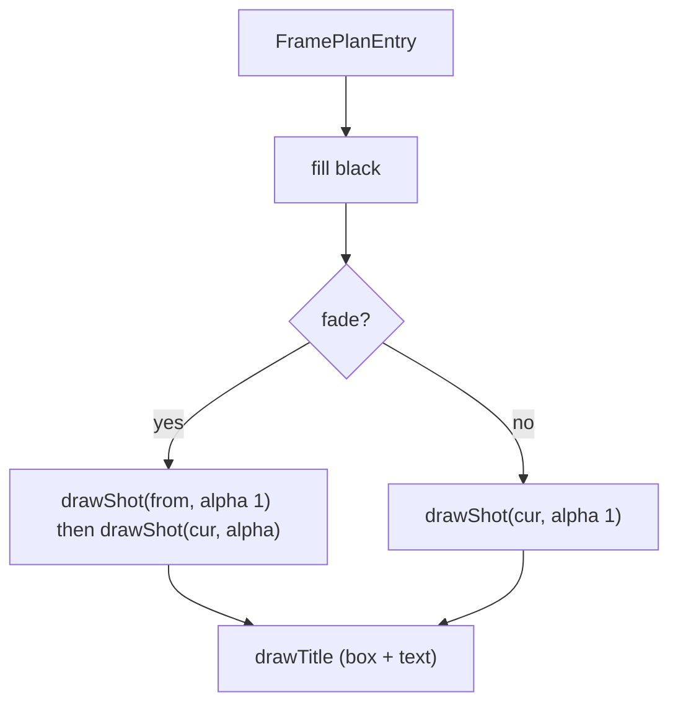

# filmFrameDrawer.ts — AI model doc

> AI-facing sidecar for `filmFrameDrawer.ts`. Created 2026-07-23 (client-side export). Keep in sync with the code on every change.

## Purpose

Draw one export frame onto the canvas — the browser counterpart of render.ts's
per-segment normalize + xfade + drawtext. Per `FramePlanEntry` it seeks the shot's
clip `<video>` to `sourceMs`, draws it object-contain over black, cross-dissolves
the outgoing shot beneath the incoming (`fade.alpha`), and paints the title card.

> ⚠️ IN-BROWSER VERIFIED ONLY — seeked `<video>` + canvas 2d have no jsdom
> equivalent. The pure `exportPlan` this consumes is unit-tested; this raster step
> is verified by a real-browser export.

## What it does (for an AI reader)

- Responsibilities: raster each frame entry (decode + composite + title).
- Public API / exports: `createFilmFrameDrawer(canvas, shots, resolveUrl)` →
  `{ draw: DrawFilmFrame, dispose }`.
- Inputs → Outputs: a `FramePlanEntry` → pixels on the canvas (consumed by the sink
  right after).
- Side effects: creates + seeks one `<video>` per generation; canvas 2d draws.

## Dependencies

- Imports: contract `Shot`/`ShotTitle`, `./exportPlan` (`FramePlanEntry`),
  `./filmExportPorts` (`DrawFilmFrame`), `./filmExportAudio` (`ResolveMediaUrl`).
- Used by: `useFilmExport` (builds the drawer, passes `draw` to `runFilmExport`).
  Lazy export chunk.

## Diagram

## Key decisions / gotchas

- **Decode = a SEEKED `<video>` per clip, not `VideoDecoder`** — it reuses the
  browser's demux/decode for whatever codec the /media clip ships in;
  `requestVideoFrameCallback` (probed by cast, `seeked` fallback) guarantees the
  frame is present before we grab it. VideoDecoder would need per-codec config we do
  not have client-side.
- **One `<video>` per generation, reused + re-seeked** — a 30-min film must not
  allocate a decoder per frame; `dispose` releases them.
- **Crossfade** draws the outgoing at full then the incoming at `alpha` — a linear
  cross-dissolve (ffmpeg xfade fade).
- **A shot with no generation** (title/empty) draws black beneath — the title box
  is then painted on top.

## Commits

- _no commit yet_
