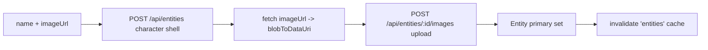

# makeCharacterApi.ts — AI component doc

> AI-facing sidecar for `makeCharacterApi.ts`. Created 2026-07-24. Keep this in sync with the code on every change.

## Purpose
TanStack Query mutation that turns an ATTACHED shot reference image into a named,
reusable `Entity` (a character) — the "make a character from this picture" bridge.
It reuses the existing entity system (no backend change): a one-off reference
becomes an `@`-mentionable subject in any prompt.

## What it does (for an AI reader)
- Responsibilities:
  - Create the character SHELL, then attach the reference PHOTO, in one chained
    `mutationFn` (a character with no image is not a reference).
  - Keep the SHARED `['entities']` cache fresh so the new character shows up in
    the composer's mention picker and the library immediately.
- Public API / exports / props / endpoints:
  - `useMakeCharacterFromReference()` → `UseMutationResult<Entity, unknown, { name: string; imageUrl: string }>`.
  - Endpoints hit: `POST /api/entities` (kind=character, name, empty description),
    then `POST /api/entities/:id/images` (`{ source: 'upload', dataUri }`).
- Inputs → Outputs: `{ name, imageUrl }` → `Entity` (with its primary reference
  image already set).
- Side effects (I/O, network, state): two POSTs + one `fetch(imageUrl)` for the
  `/media` bytes; on success `invalidateQueries(['entities'])`.

## Dependencies
- Imports / depends on: `@tanstack/react-query` (`useMutation`,
  `useQueryClient`), `@opencreate/contracts` (`Entity` type),
  `shared/libs/apiClient` (`api`), `shared/libs/blobToDataUri` (`blobToDataUri`).
- Used by: `Cinema/components/MakeCharacterModal.tsx` (the naming dialog).

## Diagram

## Key decisions / gotchas
- NO `modules/Entities` import (cross-module law): the `['entities']` key is
  declared locally and MUST stay in lockstep with `Entities/model/entitiesApi.ts`.
- The image POST AUTO-SETS `primaryImageId` server-side when the entity has no
  primary yet (entities service.ts), so there is intentionally NO third PATCH.
- No rollback if the image POST fails after the shell is created — the modal keeps
  the typed name and lets the user retry (acceptable for this scope; a retry would
  create a second empty character).

## Commits
- _no commit yet_
