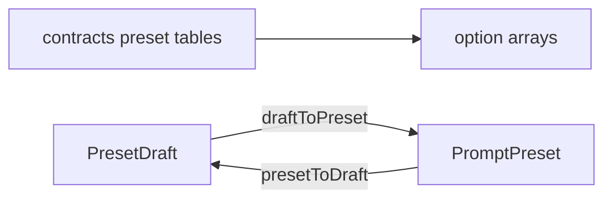

# presetOptions.ts — AI component doc

> AI-facing sidecar for `presetOptions.ts`. Created 2026-07-09. Keep this in sync with the code on every change.

## Purpose

Select-option builders and draft↔wire converters for the four prompt-preset
axes (style · framing · motion · quality), derived from the shared contract
tables so the pickers and the server's composition can never disagree.

## What it does (for an AI reader)

- Responsibilities: expose typed `SelectOption[]` per axis; define the editable
  `PresetDraft` shape; convert draft ↔ wire `PromptPreset`.
- Public API / exports:
  - `StyleChoice` (= `StyleId | ''`), `PresetDraft`
  - `STYLE_OPTIONS`, `CAMERA_SHOT_OPTIONS`, `CAMERA_MOTION_OPTIONS`, `QUALITY_OPTIONS`
  - `SHOT_DURATIONS_SECONDS`
  - `draftToPreset(draft)`, `presetToDraft(preset)`, `hasAnyPreset(draft)`
- Inputs → Outputs: contract enums/tables → option arrays; `PresetDraft` ↔ `PromptPreset`.
- Side effects: none — pure data + pure functions.

## Dependencies

- Imports: preset tables + enums + `PromptPreset` from `@opencreate/contracts`;
  `SelectOption` type from `shared/ui`.
- Used by: `PresetPickers`, `ShotInspector`, `FilmSettingsModal`, `StoryboardModal`.

## Diagram

## Key decisions / gotchas

- Options are built from each enum's `.options` (not `Object.values`) so values
  stay typed as their literal union member and the order is deterministic.
- Style widens to `''` (no first-class 'none'); the modifier axes carry their own
  'none'. `draftToPreset` drops the sentinels so the stored preset stays tidy;
  an all-empty draft → `{}`, which callers store as null.

## Commits

- _no commit yet_

## Change log (behaviour)

### 2026-07-12 — preset labels come from i18n, not from the contract table
`STYLE_OPTIONS` / `CAMERA_SHOT_OPTIONS` / `CAMERA_MOTION_OPTIONS` /
`QUALITY_OPTIONS` (constants) are replaced by `styleOptions(t)` /
`cameraShotOptions(t)` / `cameraMotionOptions(t)` / `qualityOptions(t)`.

`contracts/presets.ts` carries a `label` per preset, but those strings are
hardcoded **Russian** — they are the API's naming of a preset, not UI copy.
Rendering them directly left the Framing / Camera motion / Quality pickers
reading "Любой план" while the app was switched to EN.

The contract still owns the **enum and the id order** (so a new preset cannot be
missed); the SPA owns how it is spelled to a human, under
`cinema.preset.<axis>.<id>`. A preset added without copy now shows a visible
missing key instead of silently flipping language.

## Update 2026-07-22 — slider reaches 15s
`SHOT_DURATIONS_SECONDS` went `[2,3,5,8,10]` → `[2,3,5,8,10,12,15]`. The catalog now
offers up to 15s (wan 2.7 / Seedance 2.0 / Kling / PixVerse), and the strip slider
is the gate on what the user can even ASK for — capped at 10 it made longer clips
unreachable regardless of the catalog. Values beyond a model's own max snap down at
generation (`composeShotClipInput.nearestDuration`), so 15 on the strip stays honest
for every model (Veo, whose ceiling is 8, simply generates 8).
