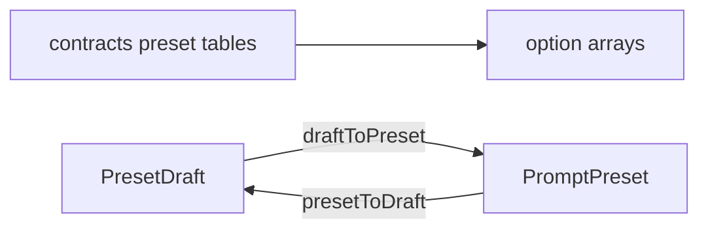

# presetOptions.ts — AI component doc

> AI-facing sidecar for `presetOptions.ts`. Created 2026-07-09. Keep this in sync with the code on every change.

## Purpose

Select-option builders and draft↔wire converters for the four prompt-preset
axes (style · framing · motion · quality), derived from the shared contract
tables so the pickers and the server's composition can never disagree.

## What it does (for an AI reader)

- Responsibilities: expose typed `SelectOption[]` per axis; define the editable
  `PresetDraft` shape; convert draft ↔ wire `PromptPreset`.
- Public API / exports:
  - `StyleChoice` (= `StyleId | ''`), `PresetDraft`
  - `STYLE_OPTIONS`, `CAMERA_SHOT_OPTIONS`, `CAMERA_MOTION_OPTIONS`, `QUALITY_OPTIONS`
  - `SHOT_DURATIONS_SECONDS`
  - `draftToPreset(draft)`, `presetToDraft(preset)`, `hasAnyPreset(draft)`
- Inputs → Outputs: contract enums/tables → option arrays; `PresetDraft` ↔ `PromptPreset`.
- Side effects: none — pure data + pure functions.

## Dependencies

- Imports: preset tables + enums + `PromptPreset` from `@opencreate/contracts`;
  `SelectOption` type from `shared/ui`.
- Used by: `PresetPickers`, `ShotInspector`, `FilmSettingsModal`, `StoryboardModal`.

## Diagram

## Key decisions / gotchas

- Options are built from each enum's `.options` (not `Object.values`) so values
  stay typed as their literal union member and the order is deterministic.
- Style widens to `''` (no first-class 'none'); the modifier axes carry their own
  'none'. `draftToPreset` drops the sentinels so the stored preset stays tidy;
  an all-empty draft → `{}`, which callers store as null.

## Commits

- _no commit yet_
