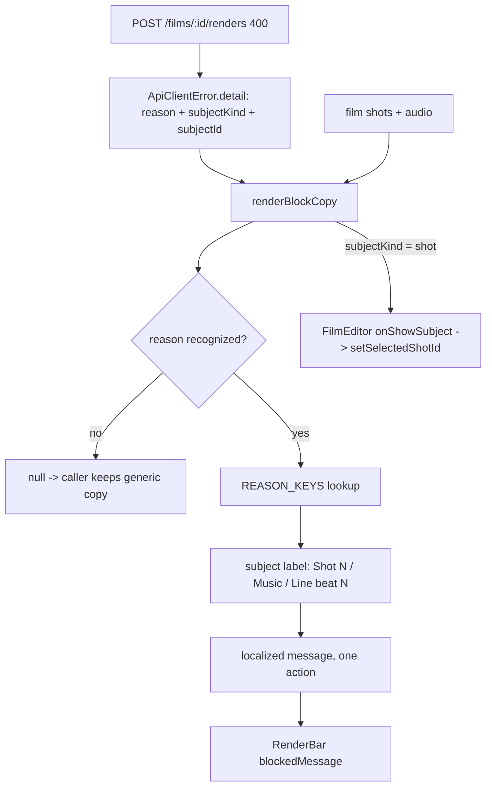

# renderBlockCopy.ts — AI component doc

> AI-facing sidecar for `renderBlockCopy.ts`. Created 2026-07-21. Keep this in sync with the code on every change.

## Purpose
Turns an export REFUSAL (`validation_failed` + a `reason` + a subject) into a localized
sentence that names the blocking shot or track and gives exactly ONE action. Replaces the
single generic string that ten different `buildPlan` refusals used to share.

## What it does (for an AI reader)
- Responsibilities: narrow the wire `reason` against this build's enum, resolve the subject
  id to a human name, and pick the copy key. Pure — no network, no state, no render.
- Public API / exports:
  - `type RenderBlock = { message: string; subjectKind: 'shot'|'audio'|'film'|undefined; subjectId: string|undefined }`
  - `renderBlockCopy(detail, shots, audio, t): RenderBlock | null` — `null` when the reason
    is absent or unrecognized, which is the caller's cue to keep the generic sentence.
- Inputs → Outputs: `ApiErrorDetail` + the film's `shots`/`audio` + `t` → a `RenderBlock`.
- Side effects: none.

## Dependencies
- Imports: `RenderBlockReason`/`renderBlockReasonSchema`, `Shot`, `FilmAudio` from
  `@opencreate/contracts`; `ApiErrorDetail` from `shared/libs/apiClient`.
- Used by: `FilmEditor.tsx`, which passes the result's `message` to `RenderBar`'s
  `blockedMessage` and turns a `shot` subject into the `onShowSubject` jump.

## Diagram

## Key decisions / gotchas
- **`REASON_KEYS` is an exhaustive `Record<RenderBlockReason, string>` on purpose.** Adding a
  member to the contract without copy here is a TYPECHECK error, not a silent fall-through to
  the generic string. Same mechanism `shared/libs/errorCopy.ts` uses for app-wide codes, and
  the reason that map has never drifted.
- **`reason` is narrowed with `safeParse`, never cast.** It crosses the network as a plain
  string; this build's enum is the only authority on what it may be. An unrecognized future
  reason returns `null` and degrades to the old generic sentence instead of throwing or
  rendering an empty string.
- **A shot's human name is its POSITION, not its title.** Timeline tiles are numbered, so
  "Shot 4" matches what the user is looking at. A deleted shot falls back to `—` rather than
  showing a raw uuid.
- **An audio track's name mirrors `Timeline.tsx`'s lane chip exactly** — a shot-attached line
  is "Line · beat 3", everything else is its kind. Two different names for the same track
  would be worse than none.
- **`Translate`'s vars parameter is REQUIRED, not optional.** Under
  `exactOptionalPropertyTypes` an optional parameter admits `undefined`, which i18next's
  overloads reject, so a `vars?:` signature is not assignable to the real `t`. Callers pass
  `{}` when there is nothing to interpolate.
- **Jump-to-subject is offered for SHOTS only.** Selection is a shot-level concept in this
  editor; an audio track or the film itself has nothing to select, and a dead button is worse
  than no button.
- **Scroll-into-view is deliberately NOT implemented.** Naming the subject and selecting it
  are cheap because `FilmEditor` already owns selection; scrolling an off-screen tile into
  view needs a ref + imperative scroll on `Timeline`'s horizontal container, which it does not
  expose. That was a scoping DECISION, not an oversight — it is the natural next step here.

## Commits
- _no commit yet_
