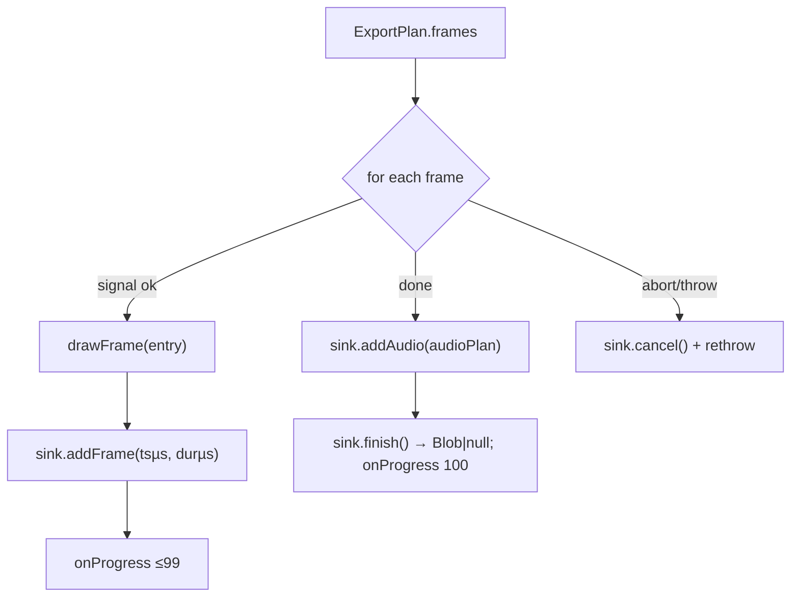

# runFilmExport.ts — AI model doc

> AI-facing sidecar for `runFilmExport.ts`. Created 2026-07-23 (client-side export). Keep in sync with the code on every change.

## Purpose

The export ORCHESTRATOR — the `renderTurntable` loop generalised to a multi-clip
film with audio. Walks the pure `exportPlan` frame by frame (draw → encode →
progress), then mixes + adds the audio, then finishes; on abort/error it cancels
the sink (no leak) and rethrows. Reads no clock — timestamps come from the plan, so
a slow device just takes longer.

## What it does (for an AI reader)

- Responsibilities: sequence the encode; report progress; guarantee teardown.
- Public API / exports: `runFilmExport(job)` → `Promise<Blob | null>` (Blob =
  in-memory fallback, null = streamed to disk); type `FilmExportJob` (`{ plan,
  audioPlan, canvas, drawFrame, onProgress?, signal?, createSink? }`).
- Inputs → Outputs: an `ExportPlan` + `AudioMixPlan` + ports → the encoded mp4.
- Side effects: drives the injected sink (encode/mux/write) + `drawFrame`; NONE of
  its own. The default sink is LAZY-imported (`./filmExportSink`).

## Dependencies

- Imports (type-only): `./audioMixPlan`, `./exportPlan`, `./filmExportPorts`.
  Runtime: a dynamic `import('./filmExportSink')` ONLY when no sink is injected.
- Used by: `useFilmExport` (the hook that runs the export). Tested by
  `runFilmExport.test.ts` (fake sink + draw).

## Diagram

## Key decisions / gotchas

- **Injectable `createSink`** (default lazy) — tests pass a fake so the whole loop
  runs in jsdom; the browser gets the real mediabunny sink from the export chunk.
- **Teardown on abort/error** — `sink.cancel()` in the catch releases muxer buffers
  / the disk stream; `finish()` is never reached on that path (pinned by tests).
- **Progress caps at 99 during frames**, hits 100 only after `finish()` — the UI's
  bar never sits at 100 while the mux is still writing.
- **No clock in the loop** — deterministic output; `signal.throwIfAborted()` at the
  top of each iteration makes cancel responsive.

## Commits

- _no commit yet_
