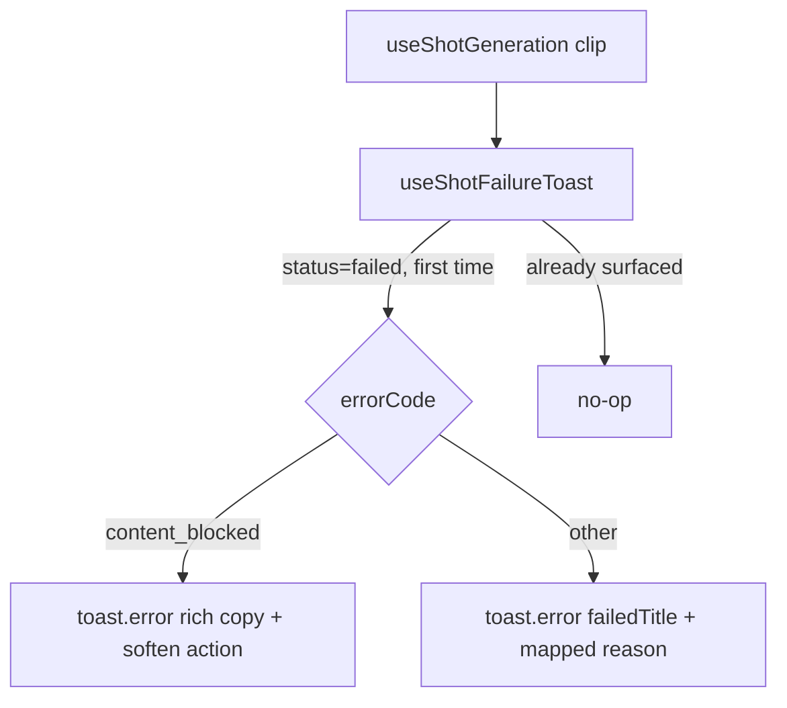

# shotFailureToast.ts — AI component doc

> AI-facing sidecar for `shotFailureToast.ts`. Created 2026-07-21. Keep this in sync with the code on every change.

## Purpose
A hook that raises a toast the FIRST time a shot's polled clip is seen `failed`. The inline `ShotClipStatus` line stays the quiet persistent record; this is the attention-grabber (the user may have scrolled away from the shot they just paid to generate). content_blocked gets rich copy + a soften/retry action; other codes get the mapped reason.

## What it does (for an AI reader)
- Responsibilities: watch `generation.status`; on the first `failed` per generationId, `toast.error(...)`. Branch on `errorCode`: `content_blocked` → `toasts.contentBlocked.*` copy + (if `onSoften` given) the soften action; else → `toasts.shot.failedTitle` + `errorCodeMessageKey(code)`. Dedupe permanently per generationId.
- Public API / exports / props / endpoints: `useShotFailureToast({ generation, onSoften })`; `__resetShotFailureDedup()` (test-only); type `ShotFailureToastArgs`.
- Inputs → Outputs: a polled `Generation` (undefined until cached) → at most ONE toast per generationId.
- Side effects (I/O, network, state): raises a toast on the shared store; mutates a module-level `Set` of surfaced generationIds. No network.

## Dependencies
- Imports / depends on: `react` (`useEffect`/`useRef`), `react-i18next`, `@opencreate/contracts` (`Generation`), `shared/ui` (`toast`), `shared/libs/errorCopy` (`errorCodeMessageKey`).
- Used by: `modules/Cinema/components/ShotInspector` (mounts it on the selected shot's clip, wiring `onSoften` = `createSoftenRetry`).

## Diagram

## Key decisions / gotchas
- Permanent per-session dedupe via a MODULE-level `Set` (survives inspector remount + re-poll re-render). The store's `dedupeKey` only collapses concurrent live copies; the durable guarantee is domain policy, so it lives here.
- `onSoften` read through a ref so the effect need not depend on its (ever-changing) identity — no re-runs, and it fires with the freshest captured prompt.
- Effect deps are `[status, id, code, t]` (primitives) — a re-poll returning the same failed row does not re-run it.
- Never raw provider text: content_blocked uses dedicated copy, others map via `errorCopy` → `errors.codes.*`.

## Commits
- (pending) feat(web): toast system + generation-failure surfacing, soften/retry, transient retry
