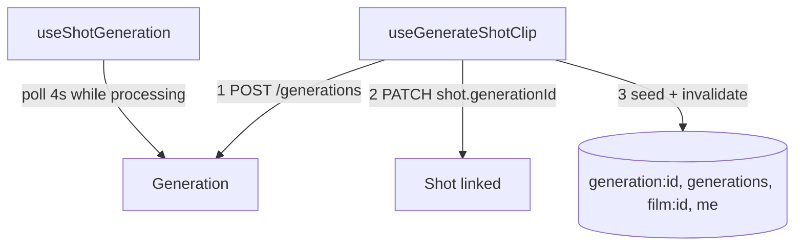

# shotGeneration.ts — AI component doc

> AI-facing sidecar for `shotGeneration.ts`. Created 2026-07-09. Keep this in sync with the code on every change.

## Purpose

The bridge from a timeline shot to the existing generation lifecycle: create a
clip, link it to the shot, then poll it. Decouples from Gallery/Generator through
the shared query cache — never through an import.

## What it does (for an AI reader)

- Responsibilities:
  - `useGenerateShotClip()`: POST `/api/generations` (body from
    `composeShotClipInput`) → PATCH `…/shots/:id` with the new `generationId`.
  - `useShotGeneration(generationId | null)`: poll GET `/api/generations/:id`
    every 4s while `processing`.
- Public API / exports: `useGenerateShotClip`, `useShotGeneration`,
  `GenerateShotClipVars` type.
- Inputs → Outputs: mutation vars `{filmId, shot, model, filmAspect}` → `Generation`.
- Side effects: network; on success seeds `['generation', id]`, prepends to the
  shared `['generations']` infinite list, invalidates `['film', id]` and `['me']`
  (charge-at-submit refreshed the balance).

## Dependencies

- Imports: `@tanstack/react-query`, contract types, `shared/libs/apiClient`,
  `composeShotClipInput`, `filmKey`.
- Used by: `ShotInspector` (Generate), `ShotThumb`/`PreviewPlayer`
  (`useShotGeneration` for status + media).

## Diagram

## Key decisions / gotchas

- Shares the `['generation', id]` and `['generations']` keys with the Gallery —
  the shot's clip also shows up in the create/library feed, with zero imports.
- Poll stops on terminal state and on a first-poll error (no data) — a stuck/failed
  endpoint is not hammered.

## Commits

- _no commit yet_
