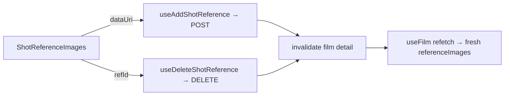

# shotReferencesApi.ts — AI component doc

> AI-facing sidecar for `Cinema/model/shotReferencesApi.ts`. Created 2026-07-22. Keep this in sync with the code on every change.

## Purpose
TanStack Query mutation hooks for a shot's ATTACHED reference images — arbitrary
pictures the user drops/pastes/uploads onto a beat ("make it look like these"),
distinct from tagged Entities. They keep the film detail cache truthful the same
way `shotsApi.ts` does.

## What it does (for an AI reader)
- Responsibilities:
  - `useAddShotReference()` — `POST /api/films/:id/shots/:shotId/references` with
    `{ dataUri }`; returns the updated `Shot`.
  - `useDeleteShotReference()` — `DELETE /api/films/:id/shots/:shotId/references/:refId`;
    returns the updated `Shot`; idempotent.
  - Both invalidate `filmKey(filmId)` on success so the inspector re-renders with
    the fresh `shot.referenceImages`.
- Public API / exports / endpoints: the two hooks above; payloads
  `{ filmId, shotId, dataUri }` and `{ filmId, shotId, refId }` are passed to
  `.mutate()` (not to the hook), matching every other mutation in this module.
- Inputs → Outputs: a data URI (add) or a ref id (delete) → the updated `Shot`,
  then a cache invalidation.
- Side effects: network (api fetch) + React Query cache invalidation only.

## Dependencies
- Imports / depends on: `@tanstack/react-query`, `@opencreate/contracts` (`Shot`),
  `shared/libs/apiClient` (`api`), and `./filmsApi` (`filmKey`).
- Used by: `Cinema/components/ShotReferenceImages.tsx`.

## Diagram

## Key decisions / gotchas
- Invalidation (not `setQueryData`) mirrors the other shot mutations: the server
  owns `referenceImages` (stored `/media` paths, never the raw bytes), so a
  refetch is the honest source of truth. The just-uploaded thumbnail therefore
  renders from the refetched Shot's `/media` path, not the client data URI.
- The API enforces the shared budget of `MAX_SHOT_REFERENCE_IMAGES` (entity tags
  + attached images) and rejects the (N+1)th with a 400 BEFORE storing. The
  component disables the add affordance at the cap AND localizes any 400.

## Commits
- _no commit yet_
