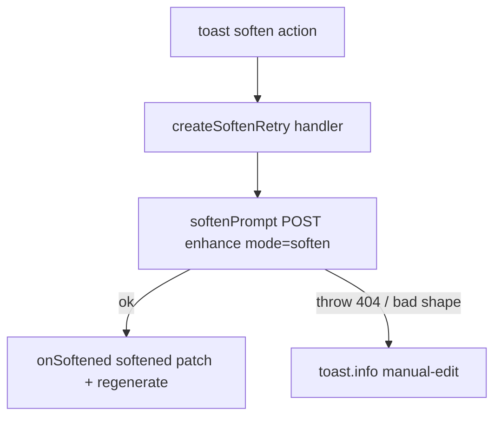

# softenRetry.ts — AI component doc

> AI-facing sidecar for `softenRetry.ts`. Created 2026-07-21. Keep this in sync with the code on every change.

## Purpose
The content_blocked "soften & retry" money-path, extracted from ShotInspector so its DEGRADE branch is unit-testable. `softenPrompt` is the imperative 'soften' call to the shared enhance endpoint; `createSoftenRetry` builds the toast-action handler that softens the blocked prompt then regenerates — degrading to a manual-edit toast when the endpoint is absent.

## What it does (for an AI reader)
- Responsibilities: (1) `softenPrompt(text)` — POST `/api/prompt/enhance` with `mode:'soften'`, validate the reply via `promptEnhanceResultSchema`, return `.prompt`; (2) `createSoftenRetry({ text, onSoftened, t })` — an async handler that softens `text` and calls `onSoftened(softened)`, or (on ANY failure) raises a manual-edit `toast.info` and returns without regenerating.
- Public API / exports / props / endpoints: `softenPrompt(text): Promise<string>`, `createSoftenRetry(deps) => () => Promise<void>`, type `SoftenRetryDeps`. Endpoint: `POST /api/prompt/enhance` (`{ text, mode:'soften' }` → `{ prompt }`).
- Inputs → Outputs: blocked prompt text → softened prompt handed to `onSoftened`, OR a degrade info toast.
- Side effects (I/O, network, state): one network POST; may raise a toast on the shared store; NO direct mutation (regenerate is `onSoftened`'s job).

## Dependencies
- Imports / depends on: `@opencreate/contracts` (`promptEnhanceResultSchema`), `shared/libs/apiClient` (`api`), `shared/ui` (`toast`), `i18next` (`TFunction` type).
- Used by: `modules/Cinema/components/ShotInspector` (wires `onSoften` for the content_blocked toast action via `useShotFailureToast`).

## Diagram

## Key decisions / gotchas
- A plain async fn, NOT a hook: it runs inside a toast action (non-React callback). The shared `useEnhancePrompt` (mode 'enhance') stays the hook for the composer; this owns 'soften' per that file's explicit delegation.
- Validates with the CONTRACT schema (`promptEnhanceResultSchema`) so a malformed 200 degrades instead of feeding an empty prompt into a paid regenerate.
- DEGRADE resolves (does not throw) so the `<Toaster>` dismisses the original content_blocked toast while the fallback stays — never a dead click, never raw server text, never a surprise charge (`onSoftened` is skipped on failure).

## Commits
- (pending) feat(web): toast system + generation-failure surfacing, soften/retry, transient retry
