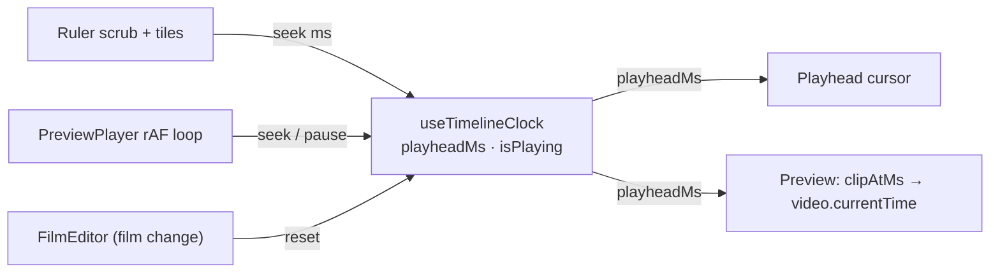

# timelineClock.ts — AI model doc

> AI-facing sidecar for `timelineClock.ts`. Created 2026-07-22 (NLE Phase 1). Keep in sync with the code on every change.

## Purpose

The single source of truth for playback position on the CinemaStudio timeline — a
tiny Zustand store holding `playheadMs` + `isPlaying`. Every editor surface (ruler,
tiles, playhead cursor, preview) reads/writes this ONE store so selection and the
playhead stay unified (ADR `docs/wiki/decisions/cinema-nle-timeline.md`).

## What it does (for an AI reader)

- Responsibilities: hold the playhead position and the transport flag; clamp seeks.
- Public API / exports: `useTimelineClock` (Zustand hook + `.getState()`),
  `TimelineClockState`, and the zoom bounds `DEFAULT_PX_PER_SEC` (24),
  `MIN_PX_PER_SEC` (1), `MAX_PX_PER_SEC` (240).
  - state: `playheadMs: number`, `isPlaying: boolean`, `zoom: number` (px/sec)
  - actions: `seek(ms, durationMs?)`, `play()`, `pause()`, `toggle()`,
    `setZoom(pxPerSec)`, `zoomIn()`, `zoomOut()` (× / ÷ 1.5, clamped),
    `fitToWindow(filmMs, containerWidthPx)`, `reset()`
- Inputs → Outputs: `seek(ms, durationMs?)` → clamped `playheadMs`
  (`[0, durationMs]`, or `[0, ∞)` when no duration is passed — caller owns the cap);
  `fitToWindow(filmMs, widthPx)` → `zoom = clamp(widthPx / (filmMs/1000))`, or the
  default when either is empty.
- Side effects: NONE. Deliberately UI-pure — no React, no timers, no DOM. The rAF
  playback loop lives in `PreviewPlayer` and only calls `seek`/`pause` here; the
  auto-follow scroll (Phase 2) measures the strip in `Timeline` and passes numbers
  to `fitToWindow`, so this store never touches the DOM.

## Dependencies

- Imports: `zustand` (`create`).
- Used by: `PreviewPlayer` (reads playhead, drives the rAF loop), `Timeline`
  (ruler scrub + tile seek + playhead cursor), `FilmEditor` (`reset()` on film
  change). It is a MODULE-internal store — not exported from `Cinema/index.ts`.

## Diagram

## Key decisions / gotchas

- **Singleton on purpose.** `/cinema/$filmId` is the only mount, so a module-level
  store lets the preview and the timeline read the SAME instance without a context
  or prop-drilling — the mechanism that unifies selection with the playhead.
- **`reset()` guards film switches.** A singleton would otherwise carry a stale
  playhead across films; `FilmEditor` resets on `filmId` change. Tests reset in
  `beforeEach` for the same reason.
- **`seek` clamp is two-sided only WITH a duration.** With no duration it clamps at
  zero only — the ruler/preview always pass the real film length; a bare
  programmatic seek stays honest without inventing a cap.
- **No timers inside the store** — that keeps it render-free and unit-testable, and
  keeps rAF-cleanup ownership in one place (PreviewPlayer).
- **Zoom lives here (ADR-reserved), not in a separate view store** — one clock
  owns position AND scale so tiles/ruler/cursor cannot drift. `fitToWindow` is a
  pure computation (the caller measures); `reset()` restores the default zoom so a
  new film opens at a known scale.

## Commits

- _no commit yet_
