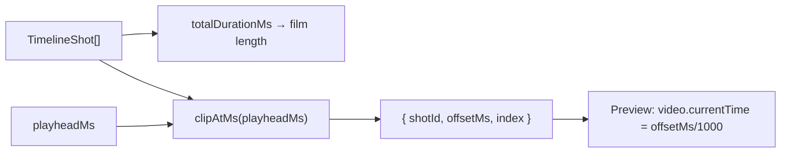

# timelineGeometry.ts — AI model doc

> AI-facing sidecar for `timelineGeometry.ts`. Created 2026-07-22 (NLE Phase 1). Keep in sync with the code on every change.

## Purpose

The pure timeline math for CinemaStudio: the film's total length and which clip a
playhead sits on (with the offset within it). Pure and render-free so the boundary
rules — clip edges, playhead at 0 / at the exact end, empty film — are unit-tested
directly. `clipAtMs` is what drives the preview's frame-accurate seek.

## What it does (for an AI reader)

- Responsibilities: total duration; playhead→clip resolution; time↔pixel mapping.
- Public API / exports:
  - `totalDurationMs(shots): number` — sum of `durationMs`.
  - `clipAtMs(shots, playheadMs): ClipAt | null` — `{ shotId, offsetMs, index }`;
    each shot owns `[start, end)`, the LAST also owns its exact `end`; `null` only
    for an empty film.
  - `msToPx(ms, pxPerSec)` / `pxToMs(px, pxPerSec)` — the zoom scale mapping.
  - `formatTimecode(ms): string` — `m:ss` ruler labels.
  - `chooseTickIntervalSec(pxPerSec): number` — a 1-2-5 nice interval so labels
    clear `MIN_LABEL_GAP_PX` (denser zoomed in, coarser zoomed out).
  - `rulerTicks(totalMs, pxPerSec): number[]` — tick times 0…total at that
    interval (always includes 0).
  - `followScroll(cursorPx, viewLeft, viewWidth): number | null` — the auto-scroll
    decision: new `scrollLeft` to recenter the playhead, or `null` to leave it
    (in view, or width 0 = unmeasured).
  - Phase 3 editing decisions (pure): `shotWidthPx(durationMs, zoom)` +
    `MIN_TILE_WIDTH_PX` (the tile width used by BOTH the lane render and reorder
    hit-testing); `windowFromEdge(orig, edge, edgeMs, {min,max})` → new trim window
    (end = out-point/duration, start = in-point with the out-point fixed, bounded);
    `snapMs(value, targets, zoom, thresholdPx)`; `clipBoundariesMs(shots)`;
    `dropIndexForX(widths, pointerX)`; `moveItem(items, from, to)`.
  - Phase 4 (pure): `splitTargetAt(shots, playheadMs)` → `{shotId, atMs}` (the shot
    under the playhead, strictly inside — `null` on a boundary/empty);
    `prevBoundaryMs(bounds, ms)` / `nextBoundaryMs(bounds, ms)` (Shift+arrow jump).
  - types `TimelineShot = { id; durationMs }`, `ClipAt`, `TrimWindow`.
- Inputs → Outputs: `(TimelineShot[], playheadMs)` → `ClipAt | null`; zoom + width
  → ruler ticks + follow-scroll offsets.
- Side effects: NONE (pure functions).

## Dependencies

- Imports: none.
- Used by: `PreviewPlayer` (`clipAtMs` picks the clip + offset, `totalDurationMs`
  bounds the rAF loop), `Timeline` (`totalDurationMs`, `msToPx`/`pxToMs`,
  `rulerTicks`/`formatTimecode`, `followScroll`, `shotWidthPx`, `splitTargetAt`),
  `useShotDrag` (`windowFromEdge`/`snapMs`/`clipBoundariesMs`/`dropIndexForX`/
  `moveItem`/`shotWidthPx` — Phase 3), and `useTimelineKeys` (`splitTargetAt`,
  `prev`/`nextBoundaryMs`, `clipBoundariesMs`, `totalDurationMs` — Phase 4).
  Module-internal — not exported from `Cinema/index.ts`.

## Diagram

## Key decisions / gotchas

- **The last shot owns its exact end.** Without that, a playhead parked at the film
  end would resolve to `null`/off-film; instead it rests on the last frame — the
  behaviour the preview needs when playback stops at the end.
- **Half-open intervals** (`[start, end)`) mean an exact clip boundary belongs to
  the NEXT clip at offset 0 — so seeking to a shot's start lands cleanly on it.
- **`pxPerSec` is a parameter, not a constant.** The zoom lives with the caller
  (`Timeline` passes `PX_PER_SEC`); Phase 2 can vary it without editing this file.
- **Structural `TimelineShot`** keeps the math decoupled from the full `Shot`
  contract (same shape `shotStartMs` accepts) and honours `noUncheckedIndexedAccess`
  with explicit `undefined` guards.

## Commits

- _no commit yet_
