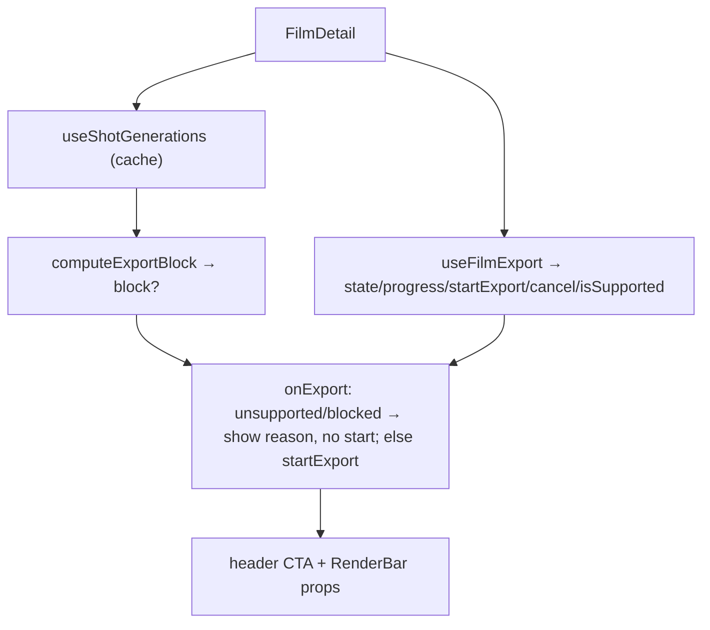

# useExportController.ts — AI model doc

> AI-facing sidecar for `useExportController.ts`. Created 2026-07-23 (client-side export). Keep in sync with the code on every change.

## Purpose

The editor-facing export controller — composes the client pipeline
(`useFilmExport`) with the client validation (`computeExportBlock` over the
generation cache) into the ONE API `FilmEditor` + `CinemaEditorHeader` + `RenderBar`
read. The cutover point from the retired server render: no `useCreateRender`/
`useRender`/`latestRender` polling; the export runs in the browser but still refuses
(named reasons) when a clip isn't ready. Extracted so FilmEditor stays thin.

## What it does (for an AI reader)

- Responsibilities: gate + drive the export; expose the header/RenderBar props.
- Public API / exports: `useExportController(film | undefined)` → `ExportController`
  (`state, progress, isStarting, canExport, errorMessage, blockedMessage,
  blockedShotId, unsupportedMessage, onExport, onCancel, onRetry`).
- Inputs → Outputs: a `FilmDetail` → the export state + the gated `onExport`.
- Side effects: `useShotGenerations` (read cache), `useFilmExport` (the pipeline).

## Dependencies

- Imports: `react`, `react-i18next`, contract `FilmDetail`, `./computeExportBlock`,
  `./useFilmExport`, `./shotGeneration` (`useShotGenerations`).
- Used by: `FilmEditor` (replaces the server-render block). Tested through
  `FilmEditor.test.tsx` (the pipeline hook mocked, the block real).

## Diagram

## Key decisions / gotchas

- **Block gated on `attempted`** — the reason shows after the user CLICKS export
  (the old server UX: click → reason), not as a persistent nag.
- **Unsupported is persistent** — the calm message shows whenever WebCodecs/FS
  Access is missing, and `canExport` is false (disabled button + a visible why).
- **Blocked keeps the button enabled** — clicking a blocked-but-supported film
  surfaces the reason and does NOT start (never a silent no-op).
- **Server-render behaviors dropped**: reload-recovery, the 409 concurrent guard,
  `latestRender` polling — they don't exist client-side (render.ts stays dormant).

## Commits

- _no commit yet_
