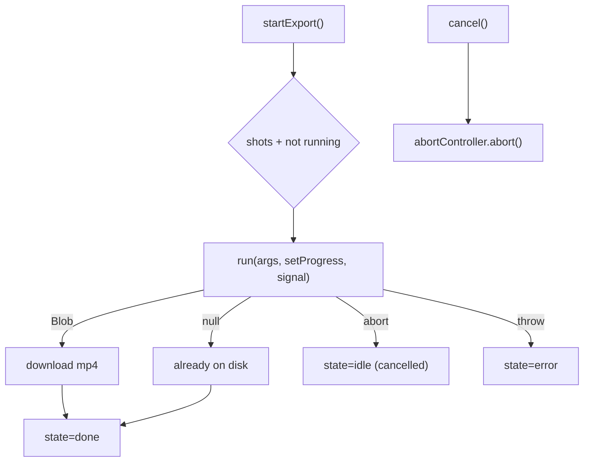

# useFilmExport.ts — AI model doc

> AI-facing sidecar for `useFilmExport.ts`. Created 2026-07-23 (client-side export). Keep in sync with the code on every change.

## Purpose

The export UI state machine — the hook the editor's export action drives INSTEAD
of the retired server render. It builds the pure plans, resolves media urls from
the shared generation cache, runs the client WebCodecs pipeline (lazy) with
progress + cancel, and downloads the Blob (fallback) or leaves the streamed file on
disk. Charges nothing (local compute). The real pipeline is browser-only, so `run`
is an injected seam the tests drive with a fake.

## What it does (for an AI reader)

- Responsibilities: own the export state; resolve media; run + cancel the pipeline.
- Public API / exports: `useFilmExport(film | undefined, run?)` (undefined =
  loading-safe: nothing exportable, `startExport` a no-op) → `{ state:
  'idle'|'running'|'done'|'error', progress, error, isSupported, startExport,
  cancel }`; types `ExportState`, `RunFilmExportFn`, `UseFilmExport`.
- Inputs → Outputs: a `FilmDetail` → the export state machine; `startExport()` runs
  the pipeline; `cancel()` aborts.
- Side effects: `useShotGenerations` (read cache); the injected `run` (default =
  lazy WebCodecs pipeline + `runFilmExport`); a Blob download on the fallback path.

## Dependencies

- Imports: `react`, contract types, `./exportPlan`, `./audioMixPlan`,
  `./exportCapabilities`, `./runFilmExport`, `./shotGeneration`
  (`useShotGenerations`), `./filmExportAudio` (type). The DEFAULT runner
  dynamic-imports `./filmFrameDrawer` + `./filmExporter` (the lazy export chunk).
- Used by: `FilmEditor` (the export action + `RenderBar` progress) — the cutover
  from `useCreateRender`. Tested by `useFilmExport.test.tsx` (injected fake run).

## Diagram

## Key decisions / gotchas

- **Injected `run` seam** — the real pipeline is browser-only (WebCodecs); the test
  injects a fake so the idle→running→done/error/cancelled machine runs in jsdom.
- **Lazy adapter** — `defaultRun` dynamic-imports the WebCodecs adapter, so the
  hook's static graph stays free of mediabunny (off the main bundle).
- **Cancel ≠ error** — an aborted run returns to `idle` (no red state); only a real
  throw is `error`.
- **Blob vs disk** — a returned Blob is downloaded; `null` means the mux streamed
  straight to disk (nothing to download).
- **No money** — export is local compute; nothing here touches credits.

## Commits

- _no commit yet_
