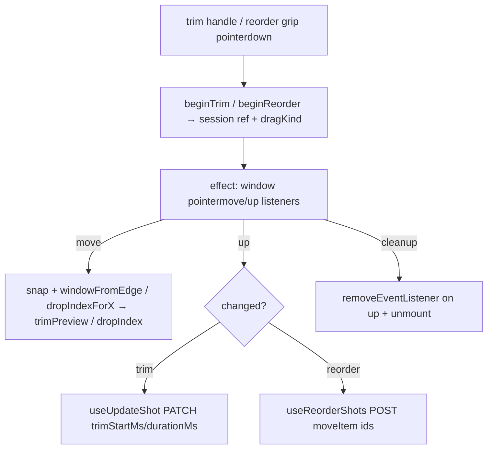

# useShotDrag.ts — AI model doc

> AI-facing sidecar for `useShotDrag.ts`. Created 2026-07-22 (NLE Phase 3). Keep in sync with the code on every change.

## Purpose

The Phase-3 on-timeline editing engine for CinemaStudio: TRIM (drag a tile's
left/right edge to change its `[trimStartMs, durationMs]` window) and REORDER (drag
a tile to a new slot). Thin, testable glue between the pointer and the PURE
decisions in `timelineGeometry`; commits through the EXISTING shot mutations — no
new endpoints.

## What it does (for an AI reader)

- Responsibilities: own the pointer drag session; snap; live-preview; commit.
- Public API / exports: `useShotDrag(filmId, shots, zoom, playheadMs, laneRef)` →
  `{ beginTrim(shotId, edge, e), beginReorder(shotId, e), trimPreview, dropIndex,
  isDragging }`. Types `TrimEdge`, `TrimPreview`, `UseShotDrag`.
- Inputs → Outputs: a pointer drag on a trim handle → `useUpdateShot` PATCH
  `{ trimStartMs, durationMs }`; a drag on the reorder grip → `useReorderShots`
  POST the moved id list. `trimPreview`/`dropIndex` drive the live UI.
- Side effects: WINDOW `pointermove`/`pointerup` listeners while a drag is active
  (added on begin, removed on up AND on unmount — no leak); the two mutations.

## Dependencies

- Imports: `react` (`useEffect`/`useRef`/`useState`), contract `Shot`,
  `./timelineGeometry` (`windowFromEdge`, `snapMs`, `clipBoundariesMs`,
  `dropIndexForX`, `moveItem`, `shotWidthPx`, `pxToMs`), `./shotsApi`
  (`useUpdateShot`, `useReorderShots`).
- Used by: `Timeline` (wires `beginTrim`/`beginReorder` onto the per-tile handles,
  renders the drop indicator + trim-preview width). Module-internal.

## Diagram

## Key decisions / gotchas

- **Window listeners, not pointer capture** — jsdom lacks `setPointerCapture`, and
  a drag that leaves the tile must still track; window listeners do both and make
  the wiring testable (fire `pointermove`/`pointerup` on `window`).
- **Commit recomputes from the UP event**, never from `trimPreview` state — no
  stale-closure race between the live preview and the persisted value.
- **The effect subscribes ONCE per drag** (dep `dragKind` + the stable `.mutate`
  fns): `setTrimPreview`/`setDropIndex` re-render without re-subscribing, and
  nothing in the layout snapshot (shots/zoom/playhead) changes mid-drag.
- **Bounds live here** (`MIN_SHOT_DURATION_MS` 500, `MAX_SHOT_DURATION_MS` 60000
  = the schema cap, `SNAP_PX` 8); the geometry stays policy-free.
- **Source-clip length is NOT enforced** — the client does not reliably know a
  generated clip's real length, so the out-point is capped only by the schema max;
  ffmpeg `trim` stops at EOF at render time. A documented Phase-3b refinement.

## Commits

- _no commit yet_
