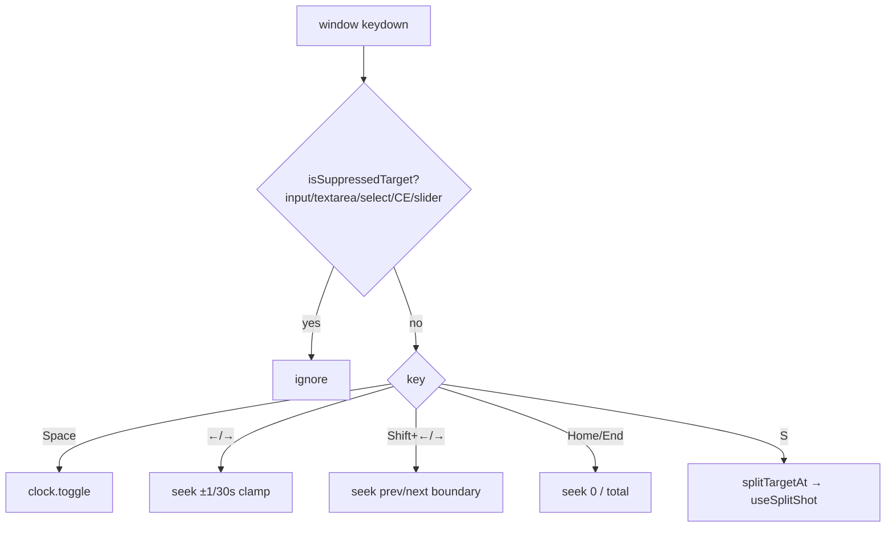

# useTimelineKeys.ts — AI model doc

> AI-facing sidecar for `useTimelineKeys.ts`. Created 2026-07-22 (NLE Phase 4). Keep in sync with the code on every change.

## Purpose

Editor-scoped keyboard control for the CinemaStudio timeline: one `keydown`
listener that drives the shared clock (play/pause, frame step, boundary jump,
seek-to-ends) and the split mutation (S). Scoped so it never fires while the user
is typing or while a control that owns the keys (the ruler slider) is focused.

## What it does (for an AI reader)

- Responsibilities: bind the editor shortcuts; gate them on focus; drive the clock
  + split.
- Public API / exports: `useTimelineKeys(filmId, shots)` → void (a side-effecting
  hook). Keys: Space=toggle, ←/→=±1/30s (clamped), Shift+←/→=prev/next shot
  boundary, Home/End=0/film-end, S=split the shot under the playhead.
- Inputs → Outputs: a keydown → `useTimelineClock` action, or `useSplitShot` POST
  `/api/films/:id/shots/:shotId/split { atMs }` (atMs from `splitTargetAt`).
- Side effects: a WINDOW `keydown` listener (removed on unmount — no leak); the
  split mutation. Reads the clock via `getState()` (fresh, no stale closure).

## Dependencies

- Imports: `react` (`useEffect`), contract `Shot`, `./timelineClock`,
  `./timelineGeometry` (`clipBoundariesMs`, `nextBoundaryMs`, `prevBoundaryMs`,
  `splitTargetAt`, `totalDurationMs`), `./shotsApi` (`useSplitShot`).
- Used by: `FilmEditor` (mounted once at the editor root; keyboard is editor-wide).
  Module-internal.

## Diagram

## Key decisions / gotchas

- **Focus-gated, not region-gated** — `isSuppressedTarget(document.activeElement)`
  bails on text entry (the composer is a `<textarea>`) AND on the ruler slider
  (`role="slider"` owns its own ←/→/Home/End), so a global listener is safe and
  no double-seek happens.
- **`preventDefault` only for handled keys** — other keys pass through untouched
  (`default: return` before the preventDefault).
- **Reads the clock via `getState()`** — the handler never goes stale and the
  effect does not re-subscribe on every playhead tick (deps: filmId, shots,
  splitMutate).
- **S splits the shot UNDER the playhead** (`splitTargetAt`), which is null on a
  boundary — the Timeline scissors BUTTON instead targets the SELECTED shot; both
  share the pure `splitTargetAt`/`clipAtMs` math.

## Commits

- _no commit yet_
