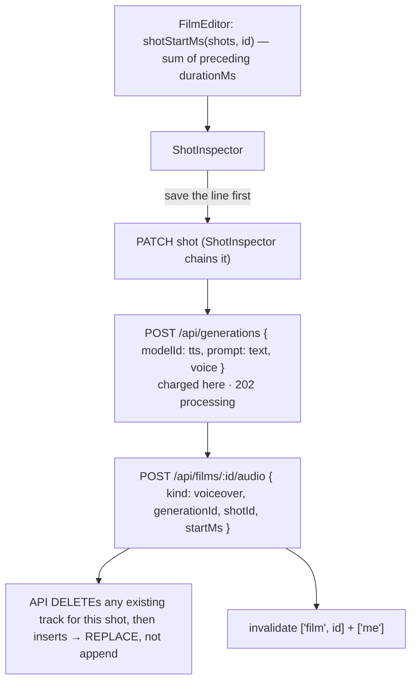

# voiceoverApi.ts — AI component doc

> AI-facing sidecar for `voiceoverApi.ts`. Created 2026-07-11. Keep this in sync with the code on every change.

## Purpose

"Voice this shot": generate the TTS clip for a shot's spoken line and file it on the
timeline under the beat that speaks it.
ADR: `docs/wiki/decisions/template-catalog.md` §4.

## What it does (for an AI reader)

- Responsibilities: chain the two calls that turn `shot.voiceover` (authored copy) into a
  `FilmAudio` track, and compute where on the timeline it belongs.
- Public API / exports:
  - `shotStartMs(shots, shotId): number` — the shot's absolute offset (the sum of every
    preceding shot's `durationMs`). Pure and exported so it can be unit-tested.
  - `useGenerateVoiceover()` → `useMutation`.
  - `GenerateVoiceoverVars = { filmId, shotId, modelId, voiceover: ShotVoiceover, startMs }`.
- Inputs → Outputs: a shot's `{ text, voice }` → `POST /api/generations` (an audio
  generation, **charged at submit**) → `POST /api/films/:filmId/audio` with `{ kind:
  'voiceover', generationId, shotId, startMs }` → a `FilmAudio` row.
- Side effects (I/O, network, state): two POSTs; **spends credits**; on success invalidates
  `['film', filmId]` and `['me']`.

## Dependencies

- Imports / depends on: `@tanstack/react-query`, `@opencreate/contracts` (`FilmAudio`,
  `Generation`, `ShotVoiceover`), `shared/libs/apiClient` (`api`), `./filmsApi` (`filmKey`).
- Used by: `ShotInspector` (`useGenerateVoiceover`), `FilmEditor` (`shotStartMs` — it is
  the only component that knows every shot's duration).

## Diagram

## Key decisions / gotchas

- **WHY THIS EXISTS.** The formats the template catalog ships — fruit dramas, cat soap
  operas, talking produce — ARE dialogue. A shot's `voiceover` field holds the line as
  authored copy (free to hold, free to edit); this turns it into audio. Without it a
  template could only hand the user a silent slideshow.
- **THE ONE NON-OBVIOUS PIECE IS `startMs`.** A `FilmAudio` track is positioned in absolute
  milliseconds from the start of the film, but the line belongs to a SHOT. So the caller
  computes the shot's offset and the track lands under the beat that speaks it. Get this
  wrong and every line plays over the wrong picture — a failure the user only discovers
  after paying for the render, and one whose symptom looks like a model problem rather than
  an arithmetic one. That is why `shotStartMs` is pure and exported.
- **It REPLACES rather than appends.** The API deletes any existing track for this shot
  before inserting (see `films/service.ts` `addAudio`). A second click is a **re-voice**,
  not a second overlapping line — but it IS a second charge, which is why
  `ShotVoiceoverField` renames the button.
- **The track is linked while the generation is still `processing`.** That is safe: the
  render skips a track whose generation has not succeeded, so nothing is silently dropped.
- **`['me']` IS invalidated here** (unlike template instantiation, which is free) — credits
  were spent, and the balance chip must not keep showing the old number.
- `shotStartMs` returns `0` for a shot that is not in the list rather than throwing; the
  caller only ever passes a shot it just read from the same film detail.
- The tts `modelId` is passed IN, not hardcoded: the catalog owns which model speaks, this
  hook only spends it.

## Commits

- _no commit yet_
