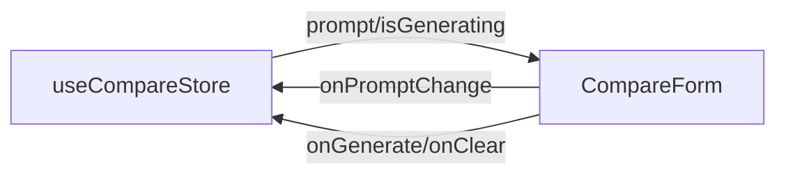

# CompareForm.tsx — prompt input + run controls

> AI-facing sidecar for `CompareForm.tsx`. Created 2026-07-29. Keep this in sync with the code on every change.

## Purpose

The `/compare` page's prompt textarea with Generate/Clear actions. Fully
CONTROLLED — the store owns the prompt; this component is presentation only.

## What it does (for an AI reader)

- Responsibilities: render the field + two buttons; enforce the disabled rules
  (blank prompt disables Generate; in-flight run disables both).
- Public API / props: `CompareFormProps { prompt, isGenerating,
  onPromptChange, onGenerate, onClear }`.
- Inputs → Outputs: keystrokes → `onPromptChange(value)`; clicks →
  `onGenerate()` / `onClear()`.
- Side effects: none.

## Dependencies

- Imports / depends on: `shared/ui` (Button).
- Used by: `routes/_shell.compare.tsx` via module index; tested by
  `CompareForm.test.tsx`.

## Diagram

## Key decisions / gotchas

- Controlled (not local state like the plan doc sketched) because `retry`
  needs the store-owned prompt — a local copy could drift after edits.
- `Button isLoading={isGenerating}` doubles as the disabled state (spinner +
  no double submits); label flips to "Generating…".
- `aria-label="Prompt"` instead of a visible label: operator tool, the page
  h1 already states the purpose.

## Commits

- c5fe185 feat(compare): скрытая страница /compare — FLUX dev vs Nano Banana Pro vs Qwen Image Max
