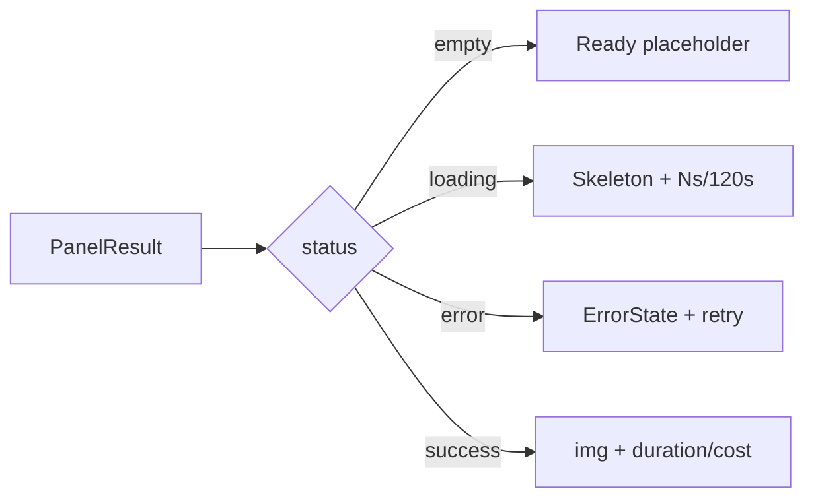

# GenerationPanel.tsx — one contender's column

> AI-facing sidecar for `GenerationPanel.tsx`. Created 2026-07-29. Keep this in sync with the code on every change.

## Purpose

Renders ONE contender's `PanelResult` through the 4 mandatory UI states
(empty / loading / error / success), completely channel-blind.

## What it does (for an AI reader)

- Responsibilities: header (label + channel), then exactly one of: ready
  placeholder · Skeleton + stopwatch ("Ns / 120s") · ErrorState with retry ·
  image + duration/cost readout.
- Public API / props: `GenerationPanelProps { label, channel, result,
  elapsedSeconds, onRetry }`.
- Inputs → Outputs: `result.status` → the matching state; retry click →
  `onRetry()` (re-runs ONLY this contender).
- Side effects: none.

## Dependencies

- Imports / depends on: `shared/ui` (ErrorState, Skeleton), `../model/types`.
- Used by: `routes/_shell.compare.tsx` via module index; tested by
  `GenerationPanel.test.tsx` (needs `shared/config/i18n` import — ErrorState
  localizes its retry label).

## Diagram

## Key decisions / gotchas

- Channel-blind by design: units/labels arrive PRE-FORMATTED (`costLabel`),
  so the component never branches on provider.
- Empty/loading keep the eventual image's `aspect-square` silhouette — the
  grid must not jump when results land.
- The stopwatch is `aria-live="polite"` and shows against the 120s server cap
  — the wait time IS the page's product.
- `alt` = `"<label> result"` so tests and screen readers can address each
  panel's image distinctly.

## Commits

- _no commit yet_
