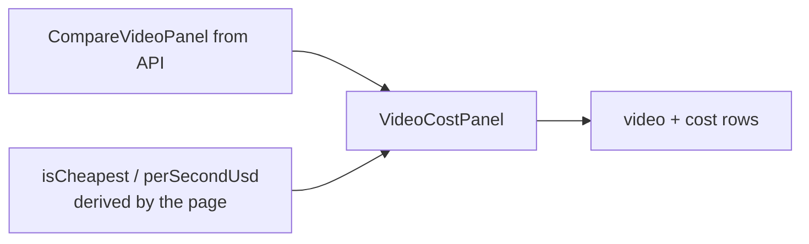

# VideoCostPanel.tsx — one channel's receipt

> AI-facing sidecar for `VideoCostPanel.tsx`. Created 2026-07-30. Keep this in sync with the code on every change.

## Purpose

Renders a single channel's outcome on `/compare-video`: the clip it produced, what
that channel actually billed, and how long it took. Presentation only.

## What it does (for an AI reader)

- Responsibilities: render one `CompareVideoPanel` across success / error /
  succeeded-but-empty; show the money rows; carry the winner accent.
- Public API / props (`VideoCostPanelProps`):
  - `panel: CompareVideoPanel` — the server's panel, rendered verbatim.
  - `isCheapest: boolean` — computed by the PAGE across both channels (this
    component cannot know about its sibling).
  - `perSecondUsd: number | null` — the page dividing this panel's own billed
    total by the run's duration. An honest division of two server numbers.
- Inputs → Outputs: props → article element. No state, no data fetching.
- Side effects: none (the `<video>` element fetches its own source).

## Dependencies

- Imports / depends on: `../model/videoTypes` (`CompareVideoPanel`) — types only.
- Used by: `routes/_shell.compare-video.tsx`; exported through
  `modules/Compare/index.ts`.

## Diagram

## Key decisions / gotchas

- **Renders ONLY figures the server sent.** No rate card, no per-second
  multiplication, no "estimated" fallback. `costUsd === null` prints "провайдер не
  назвал сумму" — which is information, not a hole to fill. Filling it from a rate
  card is precisely the failure mode the whole page exists to eliminate.
- **4 decimals below $1.** At $0.0175/s a 2-digit rounding prints $0.02 for both
  channels and erases the entire finding.
- **The credits row is kie.ai-only** and is driven by `panel.creditsConsumed`, not
  by a channel check — the server derives it from their own USD at their published
  $0.005/credit so the conversion on screen can be checked against their dashboard
  instead of trusted. DeepInfra bills USD directly and has no such row.
- **Succeeded-but-no-file is its own state**, styled as a warning: it is a real
  provider outcome that still costs money, so it must not look like an empty panel.
- **`controls`, no autoplay.** Two clips auto-playing at once on an operator page
  is noise, and one of them is usually the thing being judged.
- The panel never sees `isCheapest` logic itself; the page excludes failed and
  figure-less panels before computing it, because a dead channel is not "free".

## Commits

- _no commit yet_
