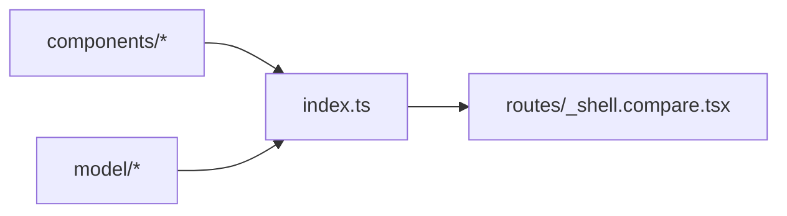

# index.ts — Compare module public API

> AI-facing sidecar for `index.ts`. Created 2026-07-29. Keep this in sync with the code on every change.

## Purpose

Barrel of the Compare module (hidden `/compare` model-evaluation page). Routes
compose ONLY through these exports — no deep imports (modular architecture
rule).

## What it does (for an AI reader)

- Responsibilities: re-export the module surface.
- Public API / exports: `CompareForm(+Props)`, `GenerationPanel(+Props)`,
  `useCompareStore`, `CompareStore`, `COMPARE_PROVIDERS`, `CompareProvider`,
  `CompareProviderId`, `PanelResult`, `PanelStatus`.
- Side effects: none.

## Dependencies

- Imports / depends on: `./components/*`, `./model/*`.
- Used by: `apps/web/src/routes/_shell.compare.tsx`.

## Diagram

## Key decisions / gotchas

- No cross-module imports: the module talks to the API through
  `shared/libs/apiClient` and to nothing in `modules/*`.

## Commits

- _no commit yet_
