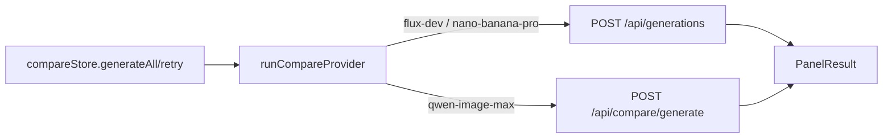

# providers.ts — Compare provider registry + runner

> AI-facing sidecar for `providers.ts`. Created 2026-07-29. Keep this in sync with the code on every change.

## Purpose

The provider registry (`COMPARE_PROVIDERS`, on-screen order) and
`runCompareProvider` — the single function that runs one contender and folds
EVERY outcome into a `PanelResult`.

## What it does (for an AI reader)

- Responsibilities: map a contender id to its wire call; measure/relay
  duration; format the cost chip per channel; never throw.
- Public API / exports: `COMPARE_PROVIDERS: CompareProvider[]`,
  `CompareProvider`, `runCompareProvider(id, prompt, signal) → Promise<PanelResult>`.
- Inputs → Outputs:
  - `flux-dev` / `nano-banana-pro` → `POST /api/generations`
    `{ modelId, prompt, aspectRatio: '1:1' }` (PRODUCTION path: charges
    credits, Runware roundtrip, /media URL). Duration client-measured;
    `costLabel` = `"<credits> cr"`.
  - `qwen-image-max` → `POST /api/compare/generate` `{ prompt }` (direct
    DeepInfra). Duration server-measured; `costLabel` = `"$<usd>"`, omitted
    when `costUsd` is null (exactOptionalPropertyTypes: conditional spread).
- Side effects: network via `shared/libs/apiClient` only.

## Dependencies

- Imports / depends on: `@opencreate/contracts` (Generation,
  CompareGenerateResult), `shared/libs/apiClient`, `./types`.
- Used by: `compareStore.ts` (and mocked there in tests), module `index.ts`
  (registry re-export for the route's panel loop).

## Diagram

## Key decisions / gotchas

- **Never throws** — a rejection would sink the store's `Promise.all` and
  freeze the whole page; every failure (incl. AbortError → "Cancelled") folds
  into `{ status: 'error' }`.
- Catalog contenders deliberately ride the FULL production pipeline (charge,
  refund-on-failure, media download) — the page compares what a user actually
  experiences.
- Adding a fourth model = one `COMPARE_PROVIDERS` entry + (if non-catalog) one
  branch in `runCompareProvider`.

## Commits

- _no commit yet_
