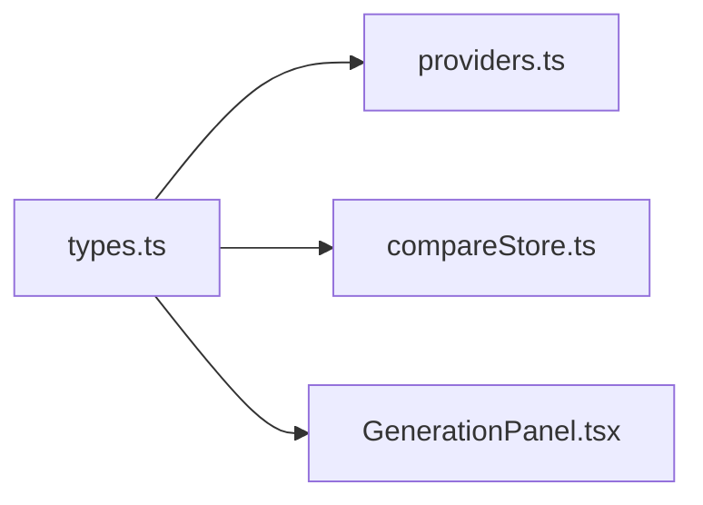

# types.ts — Compare panel types

> AI-facing sidecar for `types.ts`. Created 2026-07-29. Keep this in sync with the code on every change.

## Purpose

Panel-level types for the hidden `/compare` model-evaluation page: the three
contender ids and the per-panel result that moves through the 4 mandatory UI
states independently.

## What it does (for an AI reader)

- Responsibilities: types only — no logic, no I/O.
- Public API / exports: `CompareProviderId` (`'flux-dev' | 'nano-banana-pro' |
  'qwen-image-max'`), `PanelStatus`, `PanelResult { status, imageUrl?, error?,
  durationMs?, costLabel? }`.
- Inputs → Outputs: n/a (types).
- Side effects: none.

## Dependencies

- Imports / depends on: nothing.
- Used by: `providers.ts`, `compareStore.ts`, `components/GenerationPanel.tsx`,
  module `index.ts`.

## Diagram

## Key decisions / gotchas

- `costLabel` is a PRE-FORMATTED string ("2 cr" / "$0.075") because the units
  differ per channel (credits vs USD) and the panel must stay channel-blind.
- Two ids are real catalog model ids (`flux-dev`, `nano-banana-pro`) — they are
  sent verbatim as `modelId` to POST /api/generations; `qwen-image-max` is a
  page-local id for the DeepInfra channel, never sent to the catalog API.

## Commits

- c5fe185 feat(compare): скрытая страница /compare — FLUX dev vs Nano Banana Pro vs Qwen Image Max
