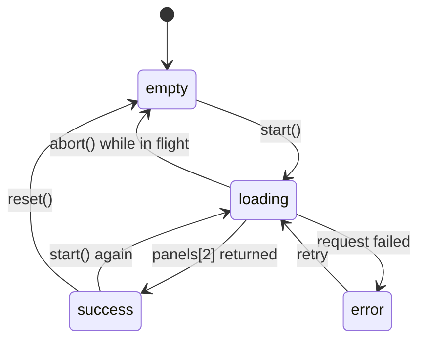

# videoCompareStore.ts — run state for the /compare-video cost page

> AI-facing sidecar for `videoCompareStore.ts`. Created 2026-07-30. Keep this in sync with the code on every change.

## Purpose

Zustand store driving the hidden `/compare-video` page: holds the form inputs,
issues the single request that races both Seedance 2.0 channels, and folds the
answer into one run state.

## What it does (for an AI reader)

- Responsibilities: form state (`prompt`, `durationSeconds`, `resolution`), the
  run lifecycle, abort handling, and the stale-response race guard.
- Public API / exports:
  - `useVideoCompareStore` — `{ prompt, durationSeconds, resolution, run,
    setPrompt, setDurationSeconds, setResolution, start, reset, abort }`
  - `VIDEO_DURATIONS` (4/5/8/10/12/15 s), `VIDEO_RESOLUTIONS` (480p/720p/1080p)
  - `VideoCompareStore`, `VideoResolution`
- Inputs → Outputs: form state → `POST /api/compare/video` → `VideoRunState`.
- Side effects: ONE network call per `start()`, which **spends real provider
  money** on both channels. No credit ledger involvement by design.

## Dependencies

- Imports / depends on: `zustand`, `@opencreate/contracts`
  (`CompareVideoResult`), `shared/libs/apiClient`, `./videoTypes`.
- Used by: `routes/_shell.compare-video.tsx`; exported through
  `modules/Compare/index.ts`.

## Diagram

## Key decisions / gotchas

- **One request, not two.** The comparison's credibility rests on both channels
  getting byte-identical settings; the server builds that input once and races the
  pipes itself. Two browser requests would let the form be edited mid-flight and
  yield a receipt whose halves priced different jobs.
- **Race guard on every write.** A response from an aborted run must never
  overwrite the run that replaced it — each write re-checks its OWN signal, the
  same shape `compareStore.ts` uses.
- **`abort()` preserves a settled run.** Leaving the page must not discard a
  receipt that cost real money; it only clears the state if a run was in flight.
- **Aborting stops the REQUEST, not the money.** Providers keep rendering and keep
  billing after the socket closes. The page says so in its copy.
- **Defaults 5s / 720p** — the cheapest configuration that still exercises the
  real product path (the catalog pins Seedance 2.0 to 720p).
- **`VIDEO_DURATIONS` is wider than the catalog sells** (which is 5/10/15): the
  endpoint accepts 4-15, and an operator probing a price curve wants the in-between
  points. Keep it inside the contract's band or the server 400s.
- The request runs for MINUTES. `apiClient` must not impose a short timeout, and
  any future retry-on-timeout would double-charge — do not add one.

## Commits

- _no commit yet_
