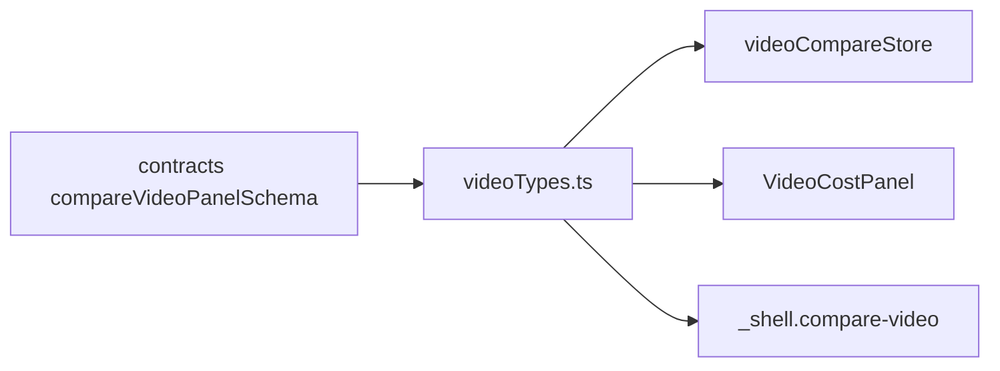

# videoTypes.ts — panel types for the /compare-video cost page

> AI-facing sidecar for `videoTypes.ts`. Created 2026-07-30. Keep this in sync with the code on every change.

## Purpose

The client-side shape of a two-channel Seedance 2.0 cost run. Separate from
`types.ts` (the image page) because the two pages ask different questions: the
image page compares three MODELS and cares what the picture looks like; this one
compares two CHANNELS carrying the same model and cares about the receipt.

## What it does (for an AI reader)

- Responsibilities: types only, zero runtime.
- Public API / exports:
  - `VideoChannelId` — `'deepinfra' | 'kie'`, in on-screen order (the incumbent
    sits left; the page exists to see whether the challenger beats it).
  - `VideoRunStatus` — the 4 mandatory UI states.
  - `VideoRunState` — a discriminated union over the WHOLE run.
  - `CompareVideoPanel` — re-exported from `@opencreate/contracts` so components
    import one module rather than reaching past the model layer.
- Inputs → Outputs: n/a (declarations).
- Side effects: none.

## Dependencies

- Imports / depends on: `@opencreate/contracts` (`CompareVideoPanel`).
- Used by: `videoCompareStore.ts`, `components/VideoCostPanel.tsx`,
  `routes/_shell.compare-video.tsx`.

## Diagram

## Key decisions / gotchas

- **Run-level state, not per-panel state.** The API settles BOTH channels in one
  response, so there is no reachable state where one panel has data and the other
  is still loading. Modelling it per-panel would invent a state the server cannot
  produce, and every consumer would then have to handle it.
- **A channel failure is NOT `status: 'error'`.** Run-level `error` means the
  request itself failed (auth, validation, rate limit, network). A channel that
  refused the job arrives INSIDE a successful response as an error panel, because
  a refusal is a measurement worth showing next to the receipt that succeeded.
- Sharing one type with the image page's `PanelResult` was rejected: it would
  force every money field optional and both pages would lose their guarantees.

## Commits

- _no commit yet_
