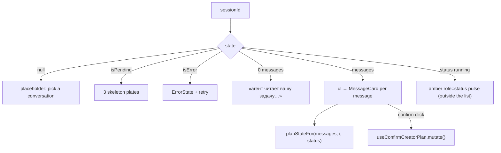

# CreatorChat.tsx — AI component doc

> AI-facing sidecar for `CreatorChat.tsx`. Created 2026-07-30. Keep this in sync with the code on every change.

## Purpose
The transcript column: one session's whole story, re-rendered from a single GET and kept current by the 2s poll. It also owns the plan-gate decision, because deciding whether a confirm button is live requires seeing the whole message list.

## What it does (for an AI reader)
- Responsibilities: the 4 UI states (nothing-selected placeholder / skeletons / error+retry / messages); the poll (through `useCreatorSession`); `planStateFor` per message; the confirm mutation; the "agent is working" pulse; auto-scroll to the newest message.
- Public API / exports / props / endpoints: `CreatorChat({ sessionId })`, `type CreatorChatProps = { sessionId: string | null }`. Endpoints reached indirectly: `GET /api/creator/sessions/:id` (polled), `POST /api/creator/sessions/:id/confirm`.
- Inputs → Outputs: a session id (or null) → the rendered transcript; a plan confirm click → the confirm mutation.
- Side effects (I/O, network, state): the polled query and the confirm mutation (both in `../model/api`); one DOM write per new message (`scrollTop`).

## Dependencies
- Imports / depends on: `react` (`useEffect`, `useRef`), `react-i18next`, `shared/ui` (`ErrorState`, `Skeleton`), `../model/api` (`useCreatorSession`, `useConfirmCreatorPlan`), `../model/planState` (`planStateFor`), `./MessageCard`.
- Used by: `CreatorWorkbench.tsx`.

## Diagram

## Key decisions / gotchas
- **`useConfirmCreatorPlan(sessionId ?? '')` is built even with no session.** Hooks must be unconditional; the empty id is unreachable because a plan card only exists inside a loaded transcript, so the mutation can never fire against `''`.
- **The empty-transcript state is a race, not a real empty state.** `createSession` persists the user's first message before answering, so `messages.length === 0` only happens between the 202 and the first poll. It still gets copy rather than a blank column (the 4-states law) — «агент читает вашу задачу…».
- **Auto-scroll drives the container's `scrollTop`, not `scrollIntoView`.** Two reasons: `scrollIntoView` is unimplemented in jsdom (the test would need a stub for behaviour that is not being tested), and it scrolls the nearest scrollable ANCESTOR, which would drag the whole page when the chat is not the scrolling element. The effect is keyed on the message COUNT, so a poll that returns an unchanged transcript does not yank the user's scroll position back down.
- **The "working" pulse renders OUTSIDE the `<ul>`.** It is not a message — nothing was persisted for it and it disappears when the next step lands — so putting it in the list would make a screen reader count a message that does not exist.
- **The region is labelled «Диалог», not «openCreator».** The page heading already carries the product name; two regions sharing an accessible name leaves a screen-reader user unable to tell the rail from the transcript (this was caught by a test that found two elements with the same name).
- **Array order is the server's** (`created_at`, `rowid`) and is rendered as-is. A client-side sort would reorder same-millisecond step messages, which is exactly the case the server's tiebreaker exists to fix.

## Commits
- _no commit yet_
