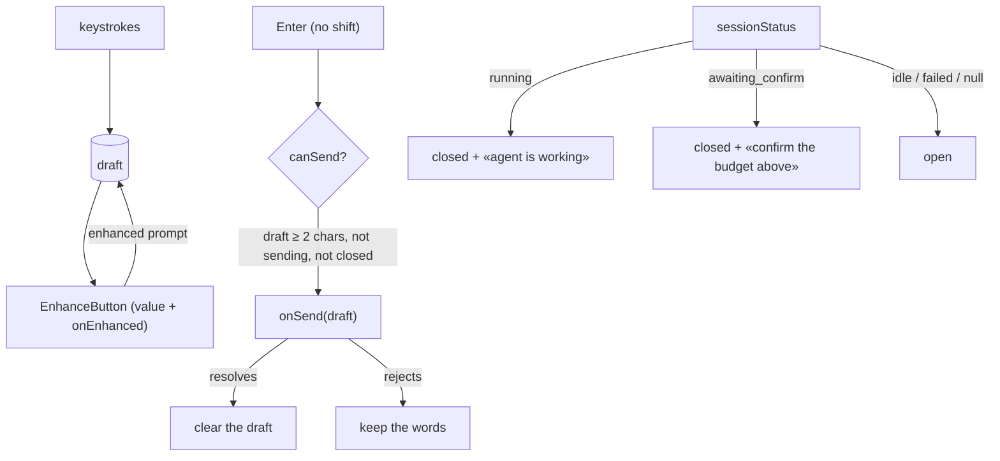

# CreatorComposer.tsx — AI component doc

> AI-facing sidecar for `CreatorComposer.tsx`. Created 2026-07-30. Keep this in sync with the code on every change.

## Purpose
The creator chat's input: a glass capsule with a growing textarea, the mandatory enhance sparkle, and a send pill. It owns the draft and the Enter/Shift+Enter contract; it does not know which endpoint the message goes to.

## What it does (for an AI reader)
- Responsibilities: hold the draft; enforce the contract's 2-character floor; send on Enter and break the line on Shift+Enter; close itself (with an explanation) while a turn runs or a plan awaits confirmation; clear the draft only when a send actually lands.
- Public API / exports / props / endpoints: `CreatorComposer(props)`, `type CreatorComposerProps = { onSend: (message: string) => Promise<void>; isSending: boolean; sessionStatus: CreatorSessionStatus | null }`. No endpoints of its own.
- Inputs → Outputs: keystrokes → local draft; Enter or the send pill → `onSend(trimmed)`; a resolved promise → cleared draft; a rejected one → the draft stays.
- Side effects (I/O, network, state): local `useState` for the draft. `EnhanceButton` (a child) posts `/api/prompt/enhance` on its own.

## Dependencies
- Imports / depends on: `react` (`useState`, `KeyboardEvent`), `react-i18next`, contract type `CreatorSessionStatus`, `shared/ui` (`Button`, `EnhanceButton`, `GLASS_FLOATING`).
- Used by: `CreatorWorkbench.tsx`.

## Diagram

## Key decisions / gotchas
- **The draft lives HERE, not in a Zustand store — a deliberate deviation from the plan**, which listed `model/creatorStore.ts` for it. Nothing outside this component reads the draft (the enhance sparkle is a child), and a store for one string with a single consumer is indirection with no payer. Consequence, and it is the correct behaviour: switching conversations unmounts the composer and clears the draft, because a draft belongs to the conversation it was typed into.
- **`onSend` returns a promise and the draft clears only on RESOLVE.** Clearing optimistically would eat the user's words on a failed send (offline, 409, 429). The `catch` is empty on purpose: the caller's mutation state already reports the failure (inline copy / toast), and an unhandled rejection would additionally trip the crash boundary for no extra information.
- **A closed input always says WHY, with two different messages.** "the agent is working" and "confirm the budget above" are different next actions; a bare greyed box communicates neither. This is the frontend-error-ux rule that a blocked state must name the way forward.
- **`failed` keeps the input OPEN.** Asking again IS the retry for an agent chat; disabling on failure would strand the conversation after a provider hiccup.
- **The enhance sparkle is mandatory (owner law) and its placement has two load-bearing rules.** The textarea gets its OWN `relative` wrapper so the sparkle sits inside the field rather than at a guessed offset from the send pill, and the absolute positioning lives on a WRAPPER div — never on `EnhanceButton`'s `className`. That class lands on the component's own `relative` box, Tailwind resolves competing position utilities by stylesheet order rather than class order, and that box is the anchor its error/nudge chip (`absolute bottom-full`) hangs from. Precedent: `ShotInspector`, gotcha documented in `Canvas/components/ImageNode.tsx.md`. The textarea carries `pr-10` so text never slides under the icon. No `nodrag` here — there is no React Flow canvas on this screen.
- **`MIN_MESSAGE_LENGTH = 2` mirrors `createCreatorSessionInputSchema`.** Enforcing it locally keeps the button honest instead of letting the API refuse a click that looked available.

## Commits
- _no commit yet_
