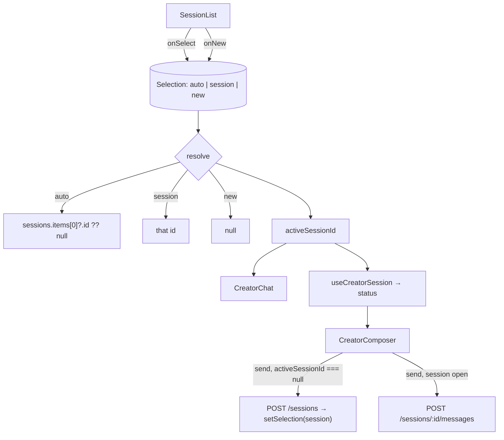

# CreatorWorkbench.tsx — AI component doc

> AI-facing sidecar for `CreatorWorkbench.tsx`. Created 2026-07-30. Keep this in sync with the code on every change.

## Purpose
The whole `/creator` screen: rail + transcript + composer. It exists as a module component (rather than living in the route file) because it holds the screen's two real decisions — which conversation is open, and whether a message opens a session or continues one — and routes in this app are composition only.

## What it does (for an AI reader)
- Responsibilities: resolve the active session (auto → newest, explicit pick, or a fresh draft); choose between `POST /sessions` and `POST /sessions/:id/messages`; read the active session's status for the composer; lay out the three panes.
- Public API / exports / props / endpoints: `CreatorWorkbench()` — no props. Endpoints reached through the hooks: `GET /api/creator/sessions`, `GET /api/creator/sessions/:id`, `POST /api/creator/sessions`, `POST /api/creator/sessions/:id/messages`.
- Inputs → Outputs: rail data + local `Selection` → the open transcript; a composer send → the correct mutation, and (for a first message) the new session becomes the selection.
- Side effects (I/O, network, state): the two queries and two mutations above; one `useState` holding the selection.

## Dependencies
- Imports / depends on: `react` (`useState`), `react-i18next`, `../model/api` (`useCreatorSessions`, `useCreatorSession`, `useCreateCreatorSession`, `usePostCreatorMessage`), `./SessionList`, `./CreatorChat`, `./CreatorComposer`.
- Used by: `modules/Creator/index.ts` → `routes/_shell.creator.tsx`.

## Diagram

## Key decisions / gotchas
- **`Selection` is a three-case union, not `string | null`.** "nothing chosen yet" and "deliberately starting a new task" must behave differently: the first resolves to the newest conversation, the second must NOT. With a bare `null`, clicking «New task» would auto-resolve straight back to the newest session and bounce the user out of the fresh draft they just asked for. A test pins that behaviour.
- **The active id is DERIVED IN RENDER, never synced by an effect.** An effect that "selects the first session" would fight the user's own click for a frame and is exactly the derived-state-in-`useEffect` the standard forbids.
- **Auto-selecting the newest conversation is what makes a reload land where the user was** without a URL parameter — the rail is ordered `updated_at DESC`, so the newest is almost always the one they were in. Known limitation of that choice: the selection is NOT shareable or deep-linkable, and a reload after switching to an older conversation lands on the newest one instead. Moving the selection into a `?session=` search param is the upgrade path; it was skipped here because no screen in this app uses search params yet and `routeTree.gen.ts` is shared with other in-flight work.
- **`usePostCreatorMessage(activeSessionId ?? '')`** — hooks must be unconditional. The empty id is unreachable: `handleSend` routes to `create` whenever the id is null.
- **The rail and this component share the `['creator-sessions']` cache entry**, so reading the list here costs no extra request. Same for `useCreatorSession`, which `CreatorChat` also polls — one entry, one 2s poll.
- **The rail is hidden below `lg`.** On a phone the conversation IS the screen; a 15-row rail beside it is not a layout, and the composer needs the width.
- **`min-h-0` on the flex children is load-bearing**: without it a flex item refuses to shrink below its content, the transcript's own scroller never engages, and the composer gets pushed off the bottom of the viewport.

## Commits
- _no commit yet_
