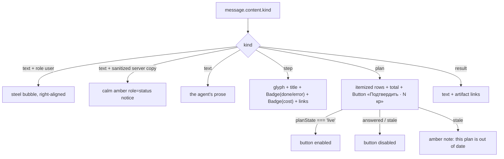

# MessageCard.tsx — AI component doc

> AI-facing sidecar for `MessageCard.tsx`. Created 2026-07-30. Keep this in sync with the code on every change.

## Purpose
Renders ONE transcript entry in the openCreator chat, branching on `content.kind` (text / step / plan / result). The agent's whole story is a list of these, and the plan variant carries the app's budget-gate button.

## What it does (for an AI reader)
- Responsibilities: render the four message shapes; localize the API's sanitized failure sentences; keep a status readable as a WORD; itemize a plan and restate its total on the confirm pill; link to the artifacts a step or result produced.
- Public API / exports / props / endpoints: `MessageCard(props)`, `type MessageCardProps = { message: CreatorMessage; planState: PlanState; onConfirm: () => void; isConfirming: boolean }`. No endpoints — it fetches nothing.
- Inputs → Outputs: one `CreatorMessage` + the plan state computed by `CreatorChat` → an `<li>`; a confirm click → `onConfirm()`.
- Side effects (I/O, network, state): none. It is purely presentational; the caller owns the mutation.

## Dependencies
- Imports / depends on: `react` (`ReactElement`), `react-i18next`, `@tanstack/react-router` (`Link`), contract type `CreatorMessage`, `shared/ui` (`Badge`, `Button`, `Card`, `STEEL_SURFACE`), `../model/agentCopy` (`agentTextKey`), `../model/planState` (type `PlanState`).
- Used by: `CreatorChat.tsx`.

## Diagram

## Key decisions / gotchas
- **The card does NOT decide whether its own confirm button is live.** `planState` arrives as a prop because the answer depends on the whole transcript (a newer plan supersedes this one) — see `model/planState.ts`. A card that guessed from its own content could authorize a budget the agent had already replaced.
- **A sanitized SERVER failure is swapped for localized copy** via `agentTextKey`, and rendered in CALM AMBER with `role="status"` — not red, not `role="alert"`. Nothing the user did is wrong; the agent's backend is off. This is the frontend-error-ux rule (no untranslated backend strings, no alarming styling) applied to text that the API deliberately put in the transcript.
- **`costCredits !== undefined`, never a truthiness check.** `0` is a real price and must print; a free step (no field) prints nothing. `if (content.costCredits)` would hide a genuine zero-credit run.
- **The status is a `Badge` with a WORD**, not a coloured dot: design.md §7 forbids colour-only status. The glyph's colour only reinforces it.
- **Four glyphs for eight tools**, grouped by what the step touched (catalog / character / board / generation). Eight distinct 16px drawings would be indistinguishable; the family is what someone scanning a long step list actually reads. Same 24-grid / 1.5-stroke / `currentColor` language as the rest of the app's icons — never an OS emoji, which would paint its own palette outside the closed system.
- **Artifact links render only for ids that exist.** A link into a board the agent never created is worse than no link, so `ArtifactLinks` returns null when both ids are absent.
- **The tool's `detail` string is a secondary caption, never the leading copy** (design.md §9): it is raw text from a tool result, and raw text may follow but never lead.
- **Each variant returns an `<li>`** because the transcript is a `<ul>` in `CreatorChat` — a `
` here would break the list semantics a screen reader uses to count messages.

## Commits
- _no commit yet_
